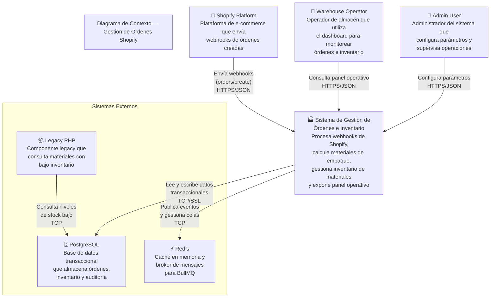
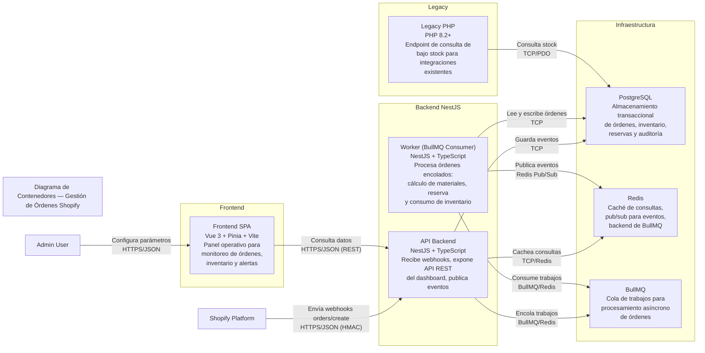
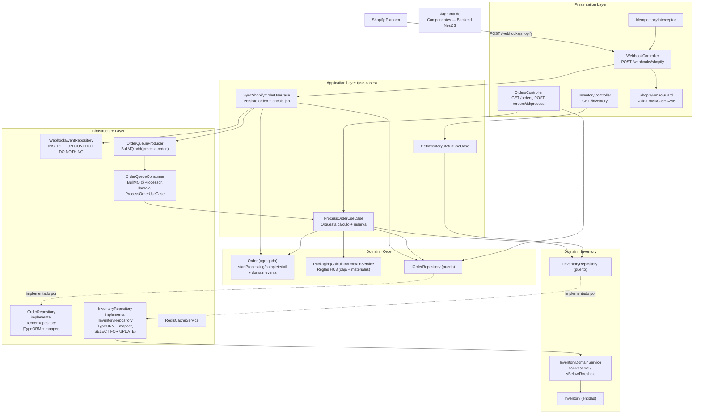
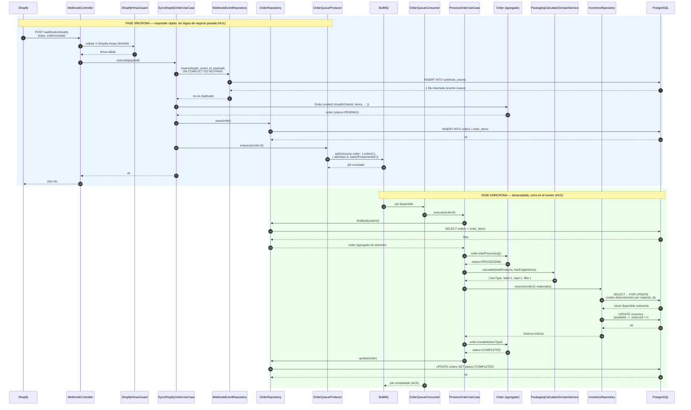
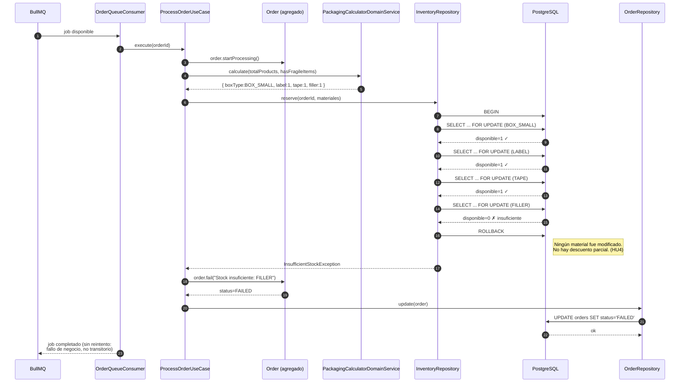
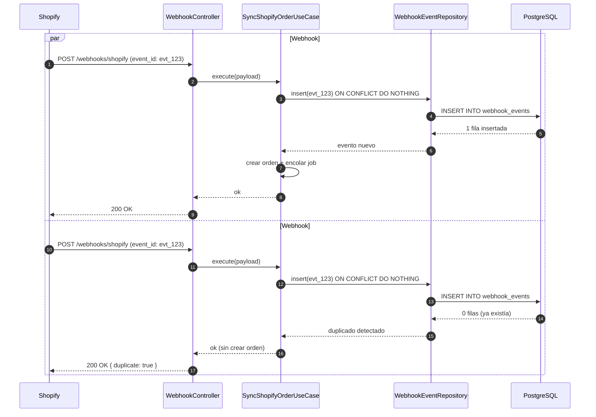
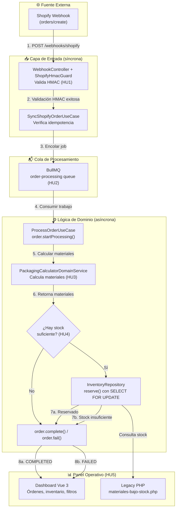
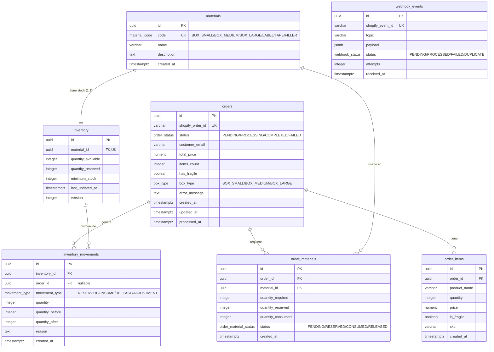
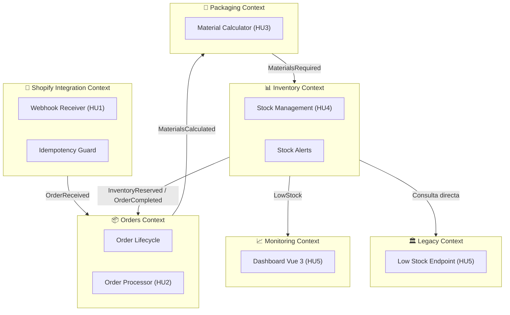

# Arquitectura del Sistema — Gestión de Órdenes Shopify e Inventario de Material de Empaque

## Tabla de Contenidos

1. [Visión General de la Arquitectura](#1-visión-general-de-la-arquitectura)
2. [Diagrama de Contexto (C4 Level 1)](#2-diagrama-de-contexto-c4-level-1)
3. [Diagrama de Contenedores (C4 Level 2)](#3-diagrama-de-contenedores-c4-level-2)
4. [Diagrama de Componentes (C4 Level 3)](#4-diagrama-de-componentes-c4-level-3)
5. [Diagrama de Secuencia — Flujo Principal](#5-diagrama-de-secuencia--flujo-principal)
6. [Diagramas de Secuencia — Flujos Alternativos](#6-diagramas-de-secuencia--flujos-alternativos)
7. [Diagrama de Flujo de Eventos](#7-diagrama-de-flujo-de-eventos)
8. [Diagrama Entidad-Relación (ERD)](#8-diagrama-entidad-relación-erd)
9. [Architecture Decision Records (ADRs)](#9-architecture-decision-records-adrs)
10. [Mapa de Bounded Contexts](#10-mapa-de-bounded-contexts)
11. [Estrategia de Comunicación entre Componentes](#11-estrategia-de-comunicación-entre-componentes)
12. [Estrategia de Manejo de Errores](#12-estrategia-de-manejo-de-errores)
13. [Consideraciones de Seguridad](#13-consideraciones-de-seguridad)
14. [Consideraciones de Escalabilidad](#14-consideraciones-de-escalabilidad)

---

## 1. Visión General de la Arquitectura

El sistema sigue una **arquitectura hexagonal (Ports & Adapters)** con patrones **Domain-Driven Design (DDD)** y **Event-Driven Architecture (EDA)**. El backend principal está construido en **NestJS** con **TypeScript**, utilizando **PostgreSQL** como base de datos transaccional, **Redis** como capa de caché y broker de mensajes, y **BullMQ** para el procesamiento asíncrono de trabajos encolados. El frontend es una **SPA** construida con **Vue 3**, **Pinia** y **Vite**. Un componente **PHP Legacy** se mantiene para compatibilidad con sistemas existentes.

### Principios Arquitectónicos

- **Separación de responsabilidades:** Cada bounded context tiene su propia lógica de dominio, capa de aplicación e infraestructura.
- **Inversión de dependencias:** Los puertos definen interfaces que los adaptadores implementan.
- **Event-Driven:** Los eventos de dominio desacoplan la lógica entre contextos.
- **CQRS ligero:** Separación de comandos (escrita) y consultas (lectura) donde aplica.
- **Resiliencia por diseño:** Reintentos con backoff exponencial, circuit breakers y dead letter queues.
- **SOLID:** Principios de responsabilidad única, abierto/cerrado, sustitución de Liskov, segregación de interfaces e inversión de dependencias.

---

## 2. Diagrama de Contexto (C4 Level 1)

### Descripción

El diagrama de contexto muestra el sistema desde una perspectiva de alto nivel, identificando los actores externos y los sistemas con los que interactúa.

### Actores y Sistemas

| Actor/Sistema | Rol | Interacción |
|---|---|---|
| **Shopify Platform** | Fuente de eventos | Envía webhooks `orders/create` al sistema |
| **Warehouse Operator** | Usuario operativo | Utiliza el dashboard para ver órdenes, inventario y alertas |
| **Admin User** | Usuario administrativo | Configura parámetros del sistema |
| **PostgreSQL** | Persistencia | Almacena órdenes, inventario, reservas y auditoría |
| **Redis** | Caché y Broker | Almacena caché de consultas frecuentes y gestiona colas BullMQ |
| **Legacy PHP** | Componente heredado | Expone endpoint de consulta de bajo stock |

---

## 3. Diagrama de Contenedores (C4 Level 2)

### Descripción

El diagrama de contenedores descompone el sistema en unidades desplegables, mostrando las tecnologías utilizadas, los protocolos de comunicación y las responsabilidades de cada contenedor.

### Detalle de Contenedores

| Contenedor | Tecnología | Responsabilidad |
|---|---|---|
| **API Backend** | NestJS + TypeScript | Recepción de webhooks con validación HMAC, exposición de API REST para el dashboard, publicación de eventos en BullMQ |
| **Worker** | NestJS + TypeScript | Consumo de trabajos BullMQ, cálculo de materiales, gestión transaccional de inventario, actualización de estados |
| **Frontend SPA** | Vue 3 + Pinia + Vite | Panel operativo con visualización de órdenes, inventario, alertas y métricas |
| **PostgreSQL** | PostgreSQL 16 | Persistencia transaccional con soporte ACID para órdenes, inventario, reservas y auditoría |
| **Redis** | Redis 7 | Caché de consultas frecuentes, pub/sub para eventos en tiempo real, backend de BullMQ |
| **BullMQ** | BullMQ + Redis | Cola de trabajos con reintentos, backoff exponencial y dead letter queue |
| **Legacy PHP** | PHP 8.2+ | Endpoint HTTP para consulta de materiales con bajo stock |

---

## 4. Diagrama de Componentes (C4 Level 3)

### Descripción

El diagrama de componentes descompone el backend en sus capas: **Presentation** (controllers, guards, interceptors), **Application** (use-cases), **Domain** (entidades, agregados, servicios de dominio, interfaces de repositorio) e **Infrastructure** (TypeORM, BullMQ, Redis), siguiendo Domain-Driven Design con arquitectura hexagonal (Ports & Adapters).

### Descripción de Componentes del Dominio

| Componente | Capa | Responsabilidad |
|---|---|---|
| **ShopifyHmacGuard** | Presentation | Valida la autenticidad de los webhooks usando HMAC-SHA256 |
| **WebhookEventRepository** | Infrastructure | Registra cada evento en `webhook_events` con `UNIQUE(shopify_event_id)` para idempotencia |
| **PackagingCalculatorDomainService** | Domain | Implementa las reglas de negocio de HU3 (tipo de caja + label/tape/filler) |
| **InventoryDomainService** | Domain | Reglas puras de inventario (`canReserve`, `calculateAvailable`, `isBelowThreshold`) |
| **OrderRepository / InventoryRepository** | Infrastructure | Implementaciones contra PostgreSQL vía TypeORM + mapper hacia el agregado de dominio |
| **Order (agregado)** | Domain | Máquina de estados `PENDING → PROCESSING → COMPLETED/FAILED`, dispara eventos de dominio |
| **OrderQueueProducer / OrderQueueConsumer** | Infrastructure | Productor/consumidor BullMQ que desacopla la recepción del webhook del procesamiento real |

---

## 5. Diagrama de Secuencia — Flujo Principal

### Descripción

Este diagrama muestra el flujo completo de procesamiento exitoso de una orden desde que Shopify envía el webhook hasta que la orden se marca como COMPLETED. Separa visualmente la fase síncrona (responder a Shopify rápido — HU1) de la fase asíncrona en el worker BullMQ (HU2).

---

## 6. Diagramas de Secuencia — Flujos Alternativos

### 6.1 Fallo por Stock Insuficiente (HU4)

Sin descuentos parciales: si **un solo** material no alcanza, no se modifica ningún stock.

### 6.2 Webhook Duplicado (Idempotencia — HU1)

Shopify reenvía el mismo evento (`orders/create`) dos veces casi simultáneamente.

---

## 7. Diagrama de Flujo de Eventos

### Descripción

El flujo de eventos muestra cómo el sistema reacciona a cada evento desde la recepción del webhook hasta el resultado final de la orden.

---

## 8. Diagrama Entidad-Relación (ERD)

### Descripción

El modelo separa el catálogo de materiales (`materials`) del stock real (`inventory`), y mantiene un historial inmutable de movimientos (`inventory_movements`).

### Descripción de Tablas

| Tabla | Propósito | Restricciones Clave |
|---|---|---|
| `orders` | Órdenes de Shopify con estado actual | `shopify_order_id` UNIQUE |
| `order_items` | Líneas de productos de cada orden | FK a `orders.id` |
| `materials` | Catálogo de materiales (sin stock) | `code` UNIQUE |
| `inventory` | Stock disponible/reservado por material | `material_id` UNIQUE |
| `inventory_movements` | Historial inmutable de movimientos | append-only |
| `order_materials` | Materiales asignados a cada orden | FK a `orders.id` y `materials.id` |
| `webhook_events` | Registro de cada webhook recibido | `shopify_event_id` UNIQUE |

---

## 9. Architecture Decision Records (ADRs)

### ADR-001: Selección de PostgreSQL como Base de Datos Principal

**Estado:** Aceptado

**Contexto:** El sistema necesita una base de datos transaccional que garantice ACID compliance para las operaciones de inventario (reserva y consumo). Las operaciones requieren aislamiento estricto para prevenir race conditions.

**Decisión:** Seleccionar **PostgreSQL** como base de datos principal. Utilizaremos `SELECT ... FOR UPDATE` para el bloqueo pesimista a nivel de fila.

**Consecuencias:**
- **Positivas:** ACID compliance nativo, prevención de race conditions, soporte para JSONB.
- **Negativas:** Requiere gestión de conexiones para alta concurrencia.
- **Alternativas consideradas:** MySQL, MongoDB.

---

### ADR-002: Uso de BullMQ sobre RabbitMQ para Cola de Trabajos

**Estado:** Aceptado

**Contexto:** El sistema necesita un sistema de colas para el procesamiento asíncrono de órdenes (HU2). Ya se seleccionó Redis como capa de caché.

**Decisión:** Utilizar **BullMQ** con Redis como backend. Integración nativa con NestJS/TypeScript.

**Consecuencias:**
- **Positivas:** Reutiliza Redis existente, reintentos con backoff exponencial, dead letter queue.
- **Negativas:** Dependencia de Redis como punto único de fallo.
- **Alternativas consideradas:** RabbitMQ, AWS SQS, Kafka.

---

### ADR-003: Bloqueo Pesimista para Operaciones de Inventario

**Estado:** Aceptado

**Contexto:** Las operaciones de reserva de inventario son el punto crítico de concurrencia (HU4). El sistema debe garantizar que nunca se venda más stock del disponible.

**Decisión:** Implementar **bloqueo pesimista** usando `SELECT ... FOR UPDATE` dentro de transacciones ACID. Acceder a materiales siempre en orden por ID (previene deadlocks).

**Consecuencias:**
- **Positivas:** Consistencia absoluta, prevención completa de race conditions.
- **Negativas:** Posible contención bajo alta demanda.
- **Alternativas consideradas:** Bloqueo optimista, Redis distribuido (Redlock).

---

### ADR-004: Validación HMAC para Webhooks de Shopify

**Estado:** Aceptado

**Contexto:** Shopify envía webhooks a nuestro endpoint público. Es crítico garantizar que los webhooks son auténticos (HU1).

**Decisión:** Implementar validación estricta de **HMAC-SHA256** en cada webhook recibido.

**Consecuencias:**
- **Positivas:** Seguridad probada, bajo costo computacional.
- **Negativas:** Requiere gestión segura del secreto compartido.
- **Mitigaciones:** Rotación periódica del secreto, almacenamiento en vault.

---

### ADR-005: Idempotencia mediante Unique Constraint

**Estado:** Aceptado

**Contexto:** Shopify puede enviar webhooks duplicados para la misma orden (HU1). Procesar un duplicado resultaría en doble descuento de inventario.

**Decisión:** Crear un **unique constraint** en `webhook_events.shopify_event_id` con `ON CONFLICT DO NOTHING`.

**Consecuencias:**
- **Positivas:** Garantiza procesamiento único a nivel de base de datos.
- **Negativas:** Requiere manejo de excepciones de violación de constraint.
- **Alternativas consideradas:** Redis SETNX, tabla separada de idempotencia.

---

### ADR-006: Procesamiento Asíncrono con BullMQ

**Estado:** Aceptado

**Contexto:** El webhook debe responder rápido sin ejecutar lógica de negocio pesada (HU1). El procesamiento real debe ser desacoplado (HU2).

**Decisión:** El webhook solo registra el evento y encola un job en BullMQ. Un worker separado consume los jobs y ejecuta el procesamiento.

**Consecuencias:**
- **Positivas:** Respuesta rápida al webhook, soporte para picos de demanda, reintentos automáticos.
- **Negativas:** Complejidad adicional de la cola, delay en el procesamiento.
- **Alternativas consideradas:** Procesamiento síncrono, threads en el mismo proceso.

---

### ADR-007: Arquitectura Hexagonal con DDD

**Estado:** Aceptado

**Contexto:** El sistema debe ser mantenible y escalable. Las reglas de negocio deben estar aisladas de la infraestructura.

**Decisión:** Implementar **arquitectura hexagonal (Ports & Adapters)** con **Domain-Driven Design**. El dominio es la única fuente de verdad.

**Consecuencias:**
- **Positivas:** Alta mantenibilidad, testabilidad, independencia de frameworks.
- **Negativas:** Mayor complejidad inicial, más archivos/estructura.
- **Alternativas consideradas:** Arquitectura en capas tradicional, ActiveRecord.

---

### ADR-008: Componente PHP Legacy

**Estado:** Aceptado

**Contexto:** El sistema legacy existente tiene integraciones que dependen de un endpoint PHP para consultar materiales con bajo inventario (HU5).

**Decisión:** Mantener un **endpoint PHP legacy** (`materiales-bajo-stock.php`) que consulta directamente PostgreSQL.

**Consecuencias:**
- **Positivas:** Compatibilidad con integraciones existentes sin cambios.
- **Negativas:** Deuda técnica, dos lenguajes en el stack.
- **Mitigaciones:** Documentar como deprecated con plan de migración.

---

### ADR-009: Docker Compose para Desarrollo

**Estado:** Aceptado

**Contexto:** El sistema tiene múltiples servicios que necesitan ejecutarse juntos (NestJS, Vue 3, PostgreSQL, Redis, PHP).

**Decisión:** Utilizar **Docker Compose** para definir y orquestar todos los servicios.

**Consecuencias:**
- **Positivas:** Entorno reproducible con un comando, refleja arquitectura de producción.
- **Negativas:** No adecuado para producción (requiere Kubernetes).
- **Mitigaciones:** Perfiles de Docker Compose para ejecutar subconjuntos de servicios.

---

## 10. Mapa de Bounded Contexts

### Descripción

### Descripción de Bounded Contexts

| Contexto | Responsabilidad | HU Relacionada |
|---|---|---|
| **Shopify Integration** | Recepción y validación de webhooks, idempotencia | HU1 |
| **Orders** | Ciclo de vida de órdenes, procesamiento masivo | HU2 |
| **Inventory** | Gestión de stock, reservas atómicas | HU4 |
| **Packaging** | Cálculo de materiales según reglas de negocio | HU3 |
| **Legacy** | Endpoint PHP para consultas de bajo stock | HU5 |
| **Monitoring** | Dashboard, filtros, estados de carga/error | HU5 |

---

## 11. Estrategia de Comunicación entre Componentes

### Comunicación Síncrona (HTTP/REST)

| Origen | Destino | Protocolo | Uso |
|---|---|---|---|
| Shopify | API Backend | HTTPS/JSON | Webhooks `orders/create` |
| Frontend Vue 3 | API Backend | HTTPS/JSON | Consultas del dashboard |
| Legacy PHP | PostgreSQL | TCP/PDO | Consulta de bajo stock |

### Comunicación Asíncrona (BullMQ + Redis)

| Origen | Destino | Mecanismo | Uso |
|---|---|---|---|
| API Backend | Worker | BullMQ Job | Encolar procesamiento de órdenes |
| Worker | API Backend | Redis Pub/Sub | Notificar cambios de estado |

---

## 12. Estrategia de Manejo de Errores

### Tipos de Errores

| Tipo | Ejemplo | Estrategia |
|---|---|---|
| **Transitorio** | Timeout de BD, error de red | Reintento con backoff exponencial (BullMQ) |
| **Negocio** | Stock insuficiente, datos inválidos | Marcar orden como FAILED, sin reintento |
| **Sistema** | Caída del proceso | Dead letter queue, alerta |

### Configuración de Reintentos (BullMQ)

| Parámetro | Valor |
|---|---|
| Máximo de reintentos | 3 |
| Backoff | Exponencial: 2s, 4s, 8s |
| Dead Letter Queue | Después de 3 fallos |

---

## 13. Consideraciones de Seguridad

| Aspecto | Implementación |
|---|---|
| **Autenticación de webhooks** | Validación HMAC-SHA256 con secreto compartido |
| **Comunicación** | HTTPS para todas las APIs expuestas |
| **Secreto HMAC** | Almacenado como variable de entorno, nunca en logs |
| **Idempotencia** | UNIQUE constraint + ON CONFLICT DO NOTHING |

---

## 14. Consideraciones de Escalabilidad

| Aspecto | Estrategia |
|---|---|
| **Procesamiento de órdenes** | Workers BullMQ escalables horizontalmente |
| **Base de datos** | Índices optimizados, conexiones pool |
| **Caché** | Redis para consultas frecuentes del dashboard |
| **Frontend** | SPA con lazy loading y paginación |

---

**Documento generado por:** OWL — Senior Software Architect
**Versión:** 3.0
**Fecha:** 2025-07-15
