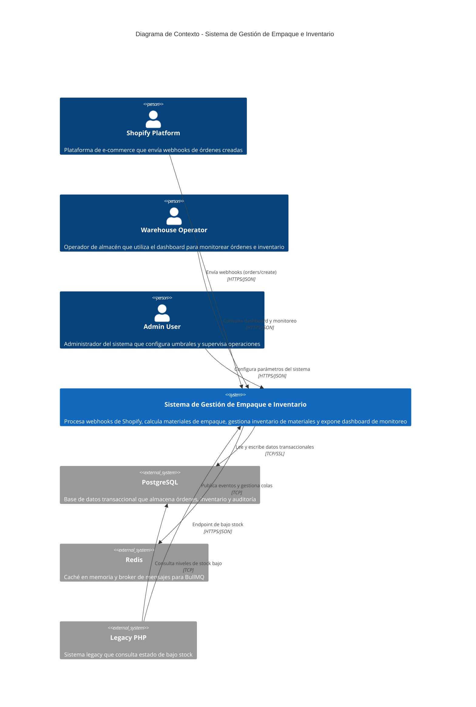
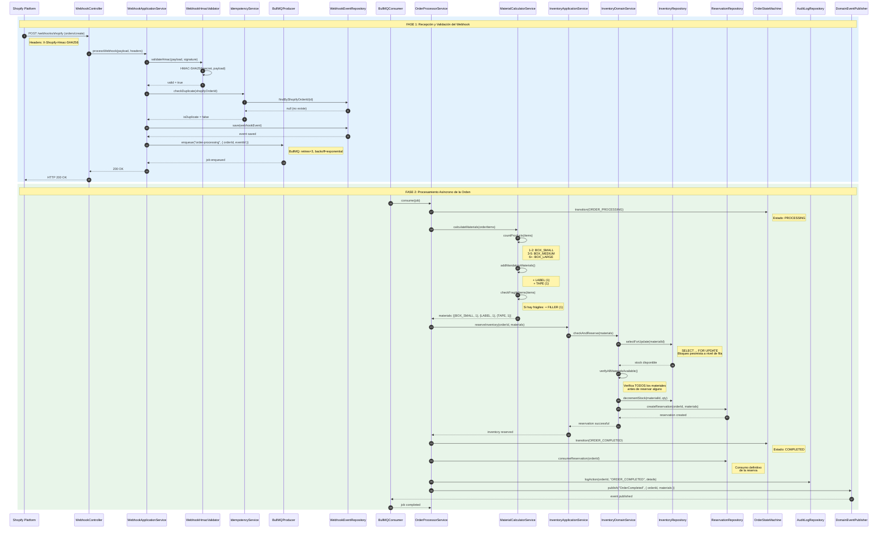
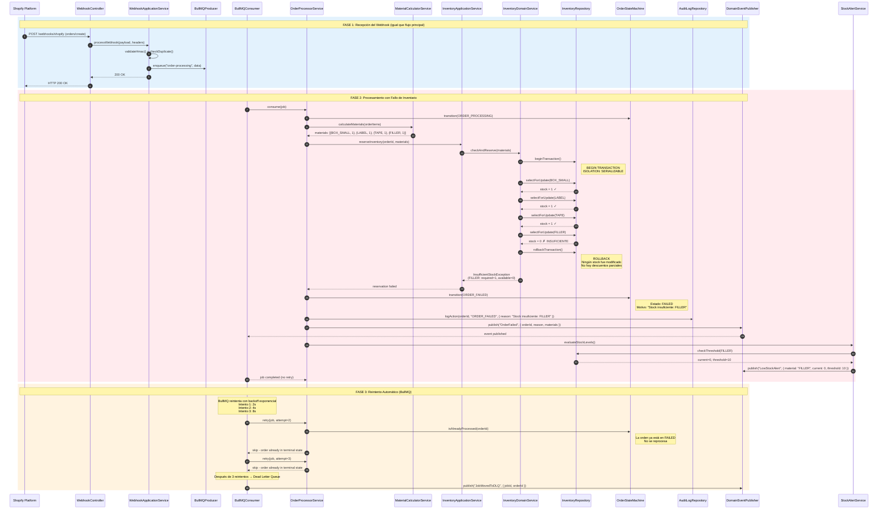
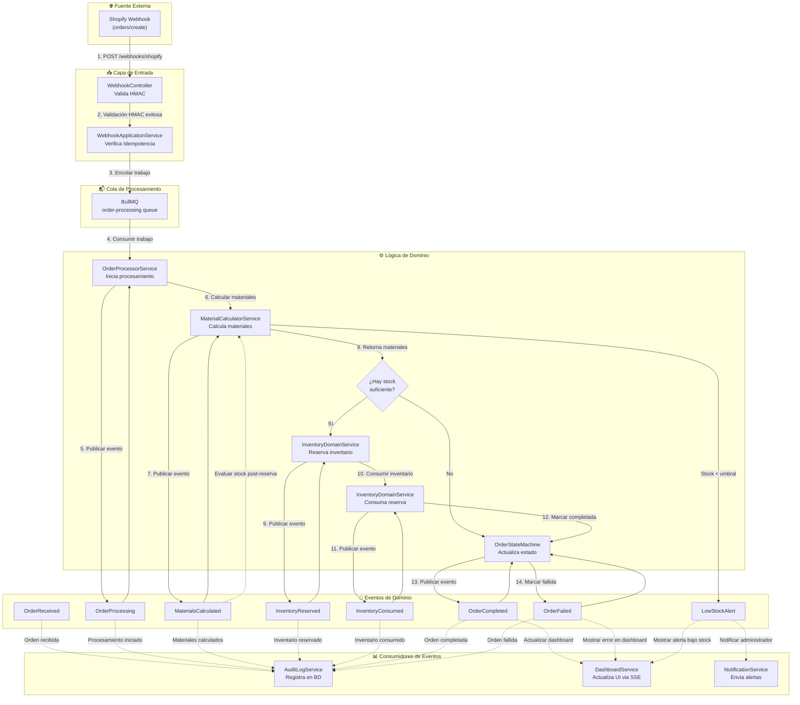
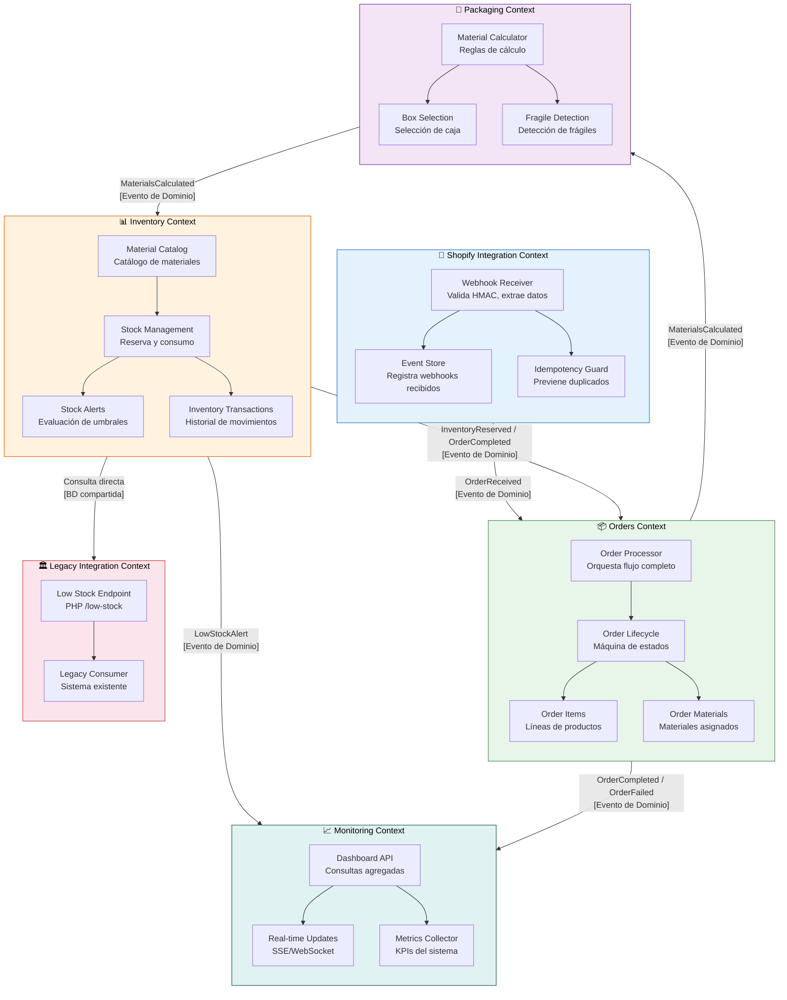
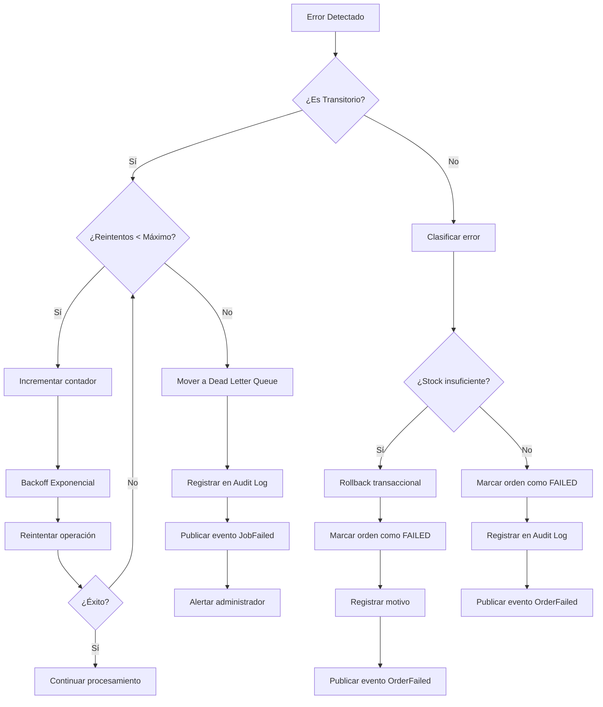

# Arquitectura del Sistema de Gestión de Empaque e Inventario para Shopify

## Tabla de Contenidos

1. [Visión General de la Arquitectura](#1-visión-general-de-la-arquitectura)
2. [Diagrama de Contexto (C4 Level 1)](#2-diagrama-de-contexto-c4-level-1)
3. [Diagrama de Contenedores (C4 Level 2)](#3-diagrama-de-contenedores-c4-level-2)
4. [Diagrama de Componentes (C4 Level 3)](#4-diagrama-de-componentes-c4-level-3)
5. [Diagrama de Secuencia - Flujo Principal](#5-diagrama-de-secuencia---flujo-principal)
6. [Diagrama de Secuencia - Flujo de Fallo de Inventario](#6-diagrama-de-secuencia---flujo-de-fallo-de-inventario)
7. [Diagrama de Flujo de Eventos](#7-diagrama-de-flujo-de-eventos)
8. [Diagrama Entidad-Relación (ERD)](#8-diagrama-entidad-relación-erd)
9. [Architecture Decision Records (ADRs)](#9-architecture-decision-records-adrs)
10. [Mapa de Bounded Contexts](#10-mapa-de-bounded-contexts)
11. [Estrategia de Comunicación entre Componentes](#11-estrategia-de-comunicación-entre-componentes)
12. [Estrategia de Manejo de Errores](#12-estrategia-de-manejo-de-errores)
13. [Consideraciones de Seguridad](#13-consideraciones-de-seguridad)
14. [Consideraciones de Escalabilidad](#14-consideraciones-de-escalabilidad)

---

## 1. Visión General de la Arquitectura

El sistema sigue una **arquitectura hexagonal (Ports & Adapters)** con patrones **Domain-Driven Design (DDD)** y **Event-Driven Architecture (EDA)**. El backend principal está construido en **NestJS** con **TypeScript**, utilizando **PostgreSQL** como base de datos transaccional, **Redis** como capa de caché y broker de mensajes, y **BullMQ** para el procesamiento asíncrono de trabajos encolados. El frontend es una **SPA** construida con **Vue 3**, **Pinia** y **Vite**. Un componente **PHP Legacy** se mantiene para compatibilidad con sistemas existentes.

### Principios Arquitectónicos

- **Separación de responsabilidades:** Cada bounded context tiene su propia lógica de dominio, capa de aplicación e infraestructura.
- **Inversión de dependencias:** Los puertos definen interfaces que los adaptadores implementan.
- **Event-Driven:** Los eventos de dominio desacoplan la lógica entre contextos.
- **CQRS ligero:** Separación de comandos (escrita) y consultas (lectura) donde aplica.
- **Resiliencia por diseño:** Reintentos con backoff exponencial, circuit breakers y dead letter queues.

---

## 2. Diagrama de Contexto (C4 Level 1)

### Descripción

El diagrama de contexto muestra el sistema desde una perspectiva de alto nivel, identificando los actores externos y los sistemas con los que interactúa. Este nivel responde a la pregunta: **¿Qué hace el sistema y quién lo usa?**



### Actores y Sistemas

| Actor/Sistema | Rol | Interacción |
|---|---|---|
| **Shopify Platform** | Fuente de eventos | Envía webhooks `orders/create` al sistema |
| **Warehouse Operator** | Usuario operativo | Utiliza el dashboard para ver órdenes, inventario y alertas |
| **Admin User** | Usuario administrativo | Configura umbrales de stock, supervisa métricas del sistema |
| **PostgreSQL** | Persistencia | Almacena órdenes, inventario, reservas y auditoría |
| **Redis** | Caché y Broker | Almacena caché de consultas frecuentes y gestiona colas BullMQ |
| **Legacy PHP** | Sistema heredado | Expone endpoint de consulta de bajo stock para integraciones existentes |

---

## 3. Diagrama de Contenedores (C4 Level 2)

### Descripción

El diagrama de contenedores descompone el sistema en unidades desplegables, mostrando las tecnologías utilizadas, los protocolos de comunicación y las responsabilidades de cada contenedor.

```mermaid
C4Container
    title Diagrama de Contenedores - Sistema de Gestión de Empaque e Inventario

    Container_Boundary(backend, "Backend NestJS") {
        Container(api, "API Backend", "NestJS + TypeScript", "Recibe webhooks, expone API REST del dashboard, publica eventos de dominio")
        Container(worker, "Worker (BullMQ Consumer)", "NestJS + TypeScript", "Procesa órdenes encolados: cálculo de materiales, reserva y consumo de inventario")
    }

    Container_Boundary(frontend, "Frontend") {
        Container(spa, "Frontend SPA", "Vue 3 + Pinia + Vite", "Dashboard interactivo para monitoreo de órdenes, inventario y alertas")
    }

    Container_Boundary(infrastructure, "Infraestructura") {
        Container(db, "PostgreSQL", "PostgreSQL v14+", "Almacenamiento transaccional de órdenes, inventario, reservas y auditoría")
        Container(redis, "Redis", "Redis v7+", "Caché de consultas, pub/sub para eventos, backend de BullMQ")
        Container(queue, "BullMQ", "BullMQ + Redis", "Cola de trabajos para procesamiento asíncrono de órdenes")
    }

    Container_Boundary(legacy, "Legacy") {
        Container(php, "Legacy PHP", "PHP v8.1+", "Endpoint de consulta de bajo stock para integraciones existentes")
    }

    Rel(shopify, api, "Envía webhooks orders/create", "HTTPS/JSON (HMAC)")
    Rel(api, queue, "Encola trabajos de procesamiento", "BullMQ/Redis Protocol")
    Rel(api, db, "Guarda eventos de webhook", "TCP/PgBouncer")
    Rel(api, redis, "Cachea consultas frecuentes", "TCP/Redis Protocol")
    Rel(worker, queue, "Consume trabajos de la cola", "BullMQ/Redis Protocol")
    Rel(worker, db, "Lee y escribe órdenes e inventario", "TCP/PgBouncer")
    Rel(worker, redis, "Publica eventos de dominio", "Redis Pub/Sub")
    Rel(worker, api, "Notifica cambios de estado", "Redis Pub/Sub")
    Rel(spa, api, "Consulta órdenes, inventario, métricas", "HTTPS/JSON (REST API)")
    Rel(spa, api, "Recibe actualizaciones en tiempo real", "WebSocket/SSE")
    Rel(php, db, "Consulta niveles de stock", "TCP/PDO")
    Rel(admin, spa, "Configura umbrales y parámetros", "HTTPS/JSON")
```

### Detalle de Contenedores

| Contenedor | Tecnología | Responsabilidad |
|---|---|---|
| **API Backend** | NestJS + TypeScript | Recepción de webhooks con validación HMAC, exposición de API REST para el dashboard, publicación de eventos en BullMQ |
| **Worker** | NestJS + TypeScript | Consumo de trabajos BullMQ, cálculo de materiales, gestión transaccional de inventario, actualización de estados |
| **Frontend SPA** | Vue 3 + Pinia + Vite | Dashboard interactivo con visualización de órdenes, inventario, alertas y métricas en tiempo real |
| **PostgreSQL** | PostgreSQL v14+ | Persistencia transaccional con soporte ACID para órdenes, inventario, reservas y auditoría |
| **Redis** | Redis v7+ | Caché de consultas frecuentes, pub/sub para eventos en tiempo real, backend de BullMQ |
| **BullMQ** | BullMQ + Redis | Cola de trabajos con reintentos, backoff exponencial y dead letter queue |
| **Legacy PHP** | PHP v8.1+ | Endpoint HTTP para consulta de materiales con bajo stock |

---

## 4. Diagrama de Componentes (C4 Level 3)

### Descripción

El diagrama de componentes descompone el API Backend y el Worker en sus componentes internos, mostrando la organización en capas (Adapters, Application, Domain, Infrastructure) siguiendo Clean Architecture y Hexagonal Architecture.

```mermaid
C4Component
    title Diagrama de Componentes - Backend NestJS

    Container_Boundary(apiBackend, "API Backend") {

        Component_Boundary(adaptersIn, "Inbound Adapters") {
            Component(webhookCtrl, "WebhookController", "NestJS Controller", "Recibe webhooks de Shopify, valida HMAC, responde 200 OK")
            Component(restApiCtrl, "DashboardController", "NestJS Controller", "Expone endpoints REST para consultas del dashboard")
            Component(sseCtrl, "SSEController", "NestJS Controller", "Envía eventos en tiempo real al frontend via Server-Sent Events")
        }

        Component_Boundary(appLayer, "Application Layer") {
            Component(webhookAppSvc, "WebhookApplicationService", "NestJS Service", "Orquesta recepción, validación y encolamiento de webhooks")
            Component(dashboardAppSvc, "DashboardApplicationService", "NestJS Service", "Coordina consultas de órdenes, inventario y métricas")
            Component(eventPublisher, "DomainEventPublisher", "NestJS Service", "Publica eventos de dominio via Redis Pub/Sub")
        }

        Component_Boundary(domainLayer, "Domain Layer") {
            Component(webhookValidator, "WebhookHmacValidator", "Domain Service", "Valida firma HMAC de webhooks de Shopify")
            Component(idempotencySvc, "IdempotencyService", "Domain Service", "Verifica duplicidad de eventos por shopify_order_id")
        }

        Component_Boundary(infraLayer, "Infrastructure Layer") {
            Component(bullProducer, "BullMQProducer", "Infrastructure Service", "Encola trabajos en BullMQ con configuración de reintentos")
            Component(redisCache, "RedisCacheService", "Infrastructure Service", "Gestiona caché de consultas con TTL configurable")
            Component(webhookRepo, "WebhookEventRepository", "Repository", "Persiste eventos de webhook en PostgreSQL")
            Component(orderRepo, "OrderRepository", "Repository", "Gestiona CRUD de órdenes en PostgreSQL")
        }
    }

    Container_Boundary(workerBackend, "Worker") {

        Component_Boundary(adaptersInW, "Inbound Adapters") {
            Component(bullConsumer, "BullMQConsumer", "NestJS Processor", "Consume trabajos de la cola order-processing")
        }

        Component_Boundary(appLayerW, "Application Layer") {
            Component(orderProcessor, "OrderProcessorService", "NestJS Service", "Orquesta el flujo completo de procesamiento de órdenes")
            Component(inventoryAppSvc, "InventoryApplicationService", "NestJS Service", "Coordina verificación, reserva y consumo de inventario")
        }

        Component_Boundary(domainLayerW, "Domain Layer") {
            Component(materialCalc, "MaterialCalculatorService", "Domain Service", "Calcula tipo de caja y materiales según reglas de negocio")
            Component(inventorySvc, "InventoryDomainService", "Domain Service", "Gestiona lógica de stock: reserva, consumo, validación")
            Component(orderMachine, "OrderStateMachine", "Domain Service", "Máquina de estados para transiciones válidas de órdenes")
            Component(stockAlertSvc, "StockAlertService", "Domain Service", "Evalúa umbrales y genera alertas de bajo stock")
        }

        Component_Boundary(infraLayerW, "Infrastructure Layer") {
            Component(inventoryRepo, "InventoryRepository", "Repository", "Gestiona materiales de empaque con SELECT FOR UPDATE")
            Component(reservationRepo, "ReservationRepository", "Repository", "Gestiona reservas de inventario por orden")
            Component(auditRepo, "AuditLogRepository", "Repository", "Registra todas las acciones para auditoría")
            Component(eventStore, "EventStore", "Infrastructure Service", "Almacena eventos de dominio para event sourcing parcial")
        }
    }

    Rel(shopify, webhookCtrl, "POST /webhooks/shopify", "HTTPS/JSON")
    Rel(webhookCtrl, webhookAppSvc, "Procesa webhook", "Method call")
    Rel(webhookAppSvc, webhookValidator, "Valida HMAC", "Method call")
    Rel(webhookAppSvc, idempotencySvc, "Verifica duplicidad", "Method call")
    Rel(webhookAppSvc, bullProducer, "Encola trabajo", "BullMQ")
    Rel(webhookAppSvc, webhookRepo, "Guarda evento", "Repository")
    Rel(webhookAppSvc, eventPublisher, "Publica OrderReceived", "Redis Pub/Sub")

    Rel(restApiCtrl, dashboardAppSvc, "Consulta datos", "Method call")
    Rel(dashboardAppSvc, orderRepo, "Lee órdenes", "Repository")
    Rel(dashboardAppSvc, inventoryRepo, "Lee inventario", "Repository")
    Rel(dashboardAppSvc, redisCache, "Consulta caché", "Redis")

    Rel(sseCtrl, eventPublisher, "Se suscribe a eventos", "Redis Pub/Sub")

    Rel(bullConsumer, orderProcessor, "Procesa trabajo", "Method call")
    Rel(orderProcessor, materialSvc, "Calcula materiales", "Method call")
    Rel(orderProcessor, inventoryAppSvc, "Gestiona inventario", "Method call")
    Rel(orderProcessor, orderMachine, "Actualiza estado", "Method call")
    Rel(orderProcessor, eventPublisher, "Publica eventos", "Redis Pub/Sub")
    Rel(materialCalc, inventorySvc, "Verifica materiales", "Method call")
    Rel(inventoryAppSvc, inventoryRepo, "Lee/actualiza stock", "Repository (FOR UPDATE)")
    Rel(inventoryAppSvc, reservationRepo, "Gestiona reservas", "Repository")
    Rel(inventoryAppSvc, stockAlertSvc, "Evalúa alertas", "Method call")
    Rel(orderProcessor, auditRepo, "Registra auditoría", "Repository")
    Rel(orderProcessor, eventStore, "Guarda evento", "Repository")
```

### Descripción de Componentes del Dominio

| Componente | Capa | Responsabilidad |
|---|---|---|
| **WebhookHmacValidator** | Domain | Valida la autenticidad de los webhooks usando HMAC-SHA256 con el secreto de Shopify |
| **IdempotencyService** | Domain | Previene procesamiento duplicado verificando shopify_order_id único |
| **MaterialCalculatorService** | Domain | Implementa las reglas de negocio RF-004 a RF-008 para calcular caja y materiales |
| **InventoryDomainService** | Domain | Lógica transaccional de reserva y consumo con bloqueo pesimista |
| **OrderStateMachine** | Domain | Define y valida transiciones de estado: PROCESSING → COMPLETED/FAILED |
| **StockAlertService** | Domain | Evalúa niveles contra umbrales configurables y genera alertas |

---

## 5. Diagrama de Secuencia - Flujo Principal

### Descripción

Este diagrama muestra el flujo completo de procesamiento exitoso de una orden desde que Shopify envía el webhook hasta que la orden se marca como COMPLETED.



---

## 6. Diagrama de Secuencia - Flujo de Fallo de Inventario

### Descripción

Este diagrama muestra el flujo cuando no hay stock suficiente para procesar una orden, demostrando el rollback transaccional que garantiza que no se realicen descuentos parciales.



---

## 7. Diagrama de Flujo de Eventos

### Descripción

Este diagrama muestra el flujo completo de eventos de dominio que ocurren durante el ciclo de vida de una orden, incluyendo eventos de éxito y fallo.



### Catálogo de Eventos de Dominio

| Evento | Descripción | Payload | Publicado por |
|---|---|---|---|
| `OrderReceived` | Webhook recibido y validado | `{ shopifyOrderId, eventId, timestamp }` | WebhookApplicationService |
| `OrderProcessing` | Orden inició procesamiento | `{ orderId, shopifyOrderId, startedAt }` | OrderProcessorService |
| `MaterialsCalculated` | Materiales calculados exitosamente | `{ orderId, materials[], totalItems, hasFragile }` | MaterialCalculatorService |
| `InventoryReserved` | Stock reservado transaccionalmente | `{ orderId, reservations[], reservedAt }` | InventoryDomainService |
| `InventoryConsumed` | Reserva consumida definitivamente | `{ orderId, consumedAt }` | InventoryDomainService |
| `OrderCompleted` | Orden procesada exitosamente | `{ orderId, completedAt, materials[] }` | OrderStateMachine |
| `OrderFailed` | Orden falló durante procesamiento | `{ orderId, reason, failedAt, stage }` | OrderStateMachine |
| `LowStockAlert` | Stock por debajo del umbral | `{ materialId, currentStock, threshold, alertAt }` | StockAlertService |

---

## 8. Diagrama Entidad-Relación (ERD)

### Descripción

El modelo de datos está diseñado para soportar las operaciones transaccionales del sistema, garantizando integridad referencial y soporte para auditoría completa.

```mermaid
erDiagram
    %% ============================================
    %% TABLA: orders
    %% Almacena las órdenes recibidas de Shopify
    %% ============================================
    orders {
        uuid id PK "Identificador único interno"
        varchar shopify_order_id UK "ID de la orden en Shopify (único)"
        varchar shopify_order_number "Número de orden visible en Shopify"
        varchar status "Estado: PROCESSING, COMPLETED, FAILED"
        text failure_reason "Motivo del fallo (si aplica)"
        integer total_products "Cantidad total de productos en la orden"
        boolean has_fragile_items "Indica si contiene productos frágiles"
        timestamp shopify_created_at "Fecha de creación en Shopify"
        timestamp created_at "Fecha de recepción en el sistema"
        timestamp updated_at "Última actualización"
        timestamp completed_at "Fecha de completado"
    }

    %% ============================================
    %% TABLA: order_items
    %% Líneas de productos de cada orden
    %% ============================================
    order_items {
        uuid id PK "Identificador único"
        uuid order_id FK "Referencia a la orden"
        varchar shopify_product_id "ID del producto en Shopify"
        varchar shopify_variant_id "ID de la variante en Shopify"
        varchar sku "Código SKU del producto"
        varchar title "Nombre del producto"
        integer quantity "Cantidad de unidades"
        boolean is_fragile "Indica si el producto es frágil"
        decimal unit_price "Precio unitario"
        timestamp created_at "Fecha de creación"
    }

    %% ============================================
    %% TABLA: order_materials
    %% Materiales de empaque asignados a cada orden
    %% ============================================
    order_materials {
        uuid id PK "Identificador único"
        uuid order_id FK "Referencia a la orden"
        uuid material_id FK "Referencia al material"
        integer quantity "Cantidad de material asignada"
        varchar material_type "Tipo: BOX_SMALL, BOX_MEDIUM, BOX_LARGE, LABEL, TAPE, FILLER"
        timestamp created_at "Fecha de asignación"
    }

    %% ============================================
    %% TABLA: materials
    %% Catálogo de materiales de empaque
    %% ============================================
    materials {
        uuid id PK "Identificador único"
        varchar sku UK "SKU del material (único)"
        varchar name "Nombre del material"
        varchar type "Tipo de material"
        text description "Descripción del material"
        integer current_stock "Stock actual disponible"
        integer reserved_stock "Stock reservado (no disponible)"
        integer low_stock_threshold "Umbral para alerta de bajo stock"
        boolean is_active "Indica si el material está activo"
        timestamp created_at "Fecha de creación"
        timestamp updated_at "Última actualización"
    }

    %% ============================================
    %% TABLA: inventory_reservations
    %% Reservas transaccionales de inventario
    %% ============================================
    inventory_reservations {
        uuid id PK "Identificador único"
        uuid order_id FK "Referencia a la orden"
        uuid material_id FK "Referencia al material"
        integer quantity "Cantidad reservada"
        varchar status "Estado: PENDING, CONSUMED, RELEASED"
        timestamp expires_at "Expiración de la reserva (timeout)"
        timestamp consumed_at "Fecha de consumo definitivo"
        timestamp created_at "Fecha de creación de la reserva"
        timestamp updated_at "Última actualización"
    }

    %% ============================================
    %% TABLA: inventory_transactions
    %% Registro de todas las transacciones de inventario
    %% ============================================
    inventory_transactions {
        uuid id PK "Identificador único"
        uuid material_id FK "Referencia al material"
        uuid order_id FK "Referencia a la orden (si aplica)"
        varchar transaction_type "Tipo: RESERVATION, CONSUMPTION, RELEASE, ADJUSTMENT"
        integer quantity "Cantidad (positiva o negativa)"
        integer stock_before "Stock antes de la transacción"
        integer stock_after "Stock después de la transacción"
        text reason "Motivo de la transacción"
        timestamp created_at "Fecha de la transacción"
    }

    %% ============================================
    %% TABLA: webhook_events
    %% Registro de todos los webhooks recibidos
    %% ============================================
    webhook_events {
        uuid id PK "Identificador único"
        varchar shopify_order_id "ID de la orden en Shopify"
        varchar webhook_topic "Tipo de webhook: orders/create"
        varchar hmac_signature "Firma HMAC del webhook"
        jsonb payload "Payload completo del webhook"
        varchar processing_status "Estado: PENDING, PROCESSED, FAILED"
        text error_message "Mensaje de error (si falló)"
        integer retry_count "Número de reintentos"
        timestamp created_at "Fecha de recepción"
        timestamp processed_at "Fecha de procesamiento"
    }

    %% ============================================
    %% TABLA: audit_logs
    %% Registro de auditoría de todas las acciones
    %% ============================================
    audit_logs {
        uuid id PK "Identificador único"
        uuid order_id FK "Referencia a la orden (si aplica)"
        uuid material_id FK "Referencia al material (si aplica)"
        varchar action "Acción realizada"
        varchar entity_type "Tipo de entidad afectada"
        uuid entity_id "ID de la entidad afectada"
        jsonb details "Detalles adicionales en JSON"
        varchar performed_by "Usuario o sistema que realizó la acción"
        timestamp created_at "Fecha de la acción"
    }

    %% ============================================
    %% TABLA: stock_alerts
    %% Alertas generadas por bajo stock
    %% ============================================
    stock_alerts {
        uuid id PK "Identificador único"
        uuid material_id FK "Referencia al material"
        varchar alert_type "Tipo: LOW_STOCK, CRITICAL_STOCK, OUT_OF_STOCK"
        integer current_stock "Stock actual al generar la alerta"
        integer threshold "Umbral configurado"
        boolean is_acknowledged "Indica si la alerta fue reconocida"
        varchar acknowledged_by "Usuario que reconoció la alerta"
        timestamp acknowledged_at "Fecha de reconocimiento"
        timestamp created_at "Fecha de creación de la alerta"
    }

    %% ============================================
    %% RELACIONES
    %% ============================================
    orders ||--o{ order_items : "tiene"
    orders ||--o{ order_materials : "requiere"
    orders ||--o{ inventory_reservations : "tiene"
    orders ||--o{ inventory_transacciones : "genera"
    orders ||--o{ audit_logs : "registra"
    materials ||--o{ order_materials : "usado en"
    materials ||--o{ inventory_reservations : "reservado en"
    materials ||--o{ inventory_transacciones : "afectado por"
    materials ||--o{ stock_alertas : "genera"
    webhook_events ||--|| orders : "origina"
```



### Descripción de Tablas

| Tabla | Propósito | Restricciones Clave |
|---|---|---|
| `orders` | Almacena órdenes de Shopify con su estado actual | `shopify_order_id` UNIQUE NOT NULL |
| `order_items` | Líneas de productos de cada orden | FK a `orders.id`, cantidad > 0 |
| `order_materials` | Materiales de empaque asignados por orden | FK a `orders.id` y `materials.id` |
| `materials` | Catálogo de materiales con stock actual | `sku` UNIQUE, `current_stock` >= 0 |
| `inventory_reservations` | Reservas transaccionales con expiración | FK a `orders.id` y `materials.id` |
| `inventory_transactions` | Historial inmutable de movimientos de stock | Todas las transacciones son append-only |
| `webhook_events` | Registro de webhooks para trazabilidad y replay | `shopify_order_id` para idempotencia |
| `audit_logs` | Auditoría completa de todas las operaciones | Append-only, no se eliminan registros |
| `stock_alertas` | Alertas de bajo stock con reconocimiento | FK a `materials.id` |

---

## 9. Architecture Decision Records (ADRs)

### ADR-001: Selección de PostgreSQL como Base de Datos Principal

**Estado:** Aceptado
**Fecha:** 2024-01-15
**Decisores:** Arquitecto de Software Senior

**Contexto:**
El sistema necesita una base de datos transaccional que garantice ACID compliance para las operaciones de inventario (reserva y consumo). Las operaciones de reserva requieren lecturas y escrituras concurrentes con aislamiento estricto para prevenir race conditions. Además, el sistema necesita soportar consultas complejas para el dashboard y reportes de auditoría.

**Decisión:**
Seleccionar **PostgreSQL v14+** como la base de datos principal del sistema. Utilizaremos el nivel de aislamiento SERIALIZABLE para las transacciones de inventario y SELECT ... FOR UPDATE para el bloqueo pesimista a nivel de fila.

**Consecuencias:**
- **Positivas:**
  - ACID compliance nativo garantiza consistencia transaccional
  - SELECT ... FOR UPDATE previene race conditions en reservas concurrentes
  - Soporte para JSONB permite almacenar payloads de webhooks de forma flexible
  - Índices parciales y de expresión optimizan consultas del dashboard
  - Replicación nativa para futura escalabilidad de lecturas
- **Negativas:**
  - Requiere gestión de conexiones (PgBouncer) para manejar alta concurrencia
  - El nivel SERIALIZABLE puede causar más abortos de transacciones bajo alta contención
  - Mayor complejidad operacional comparada con bases de datos NoSQL
- **Alternativas consideradas:**
  - MySQL: Menor soporte para JSONB y niveles de aislamiento
  - MongoDB: No ACID transaccional nativo (hasta v4.0 con limitaciones)

---

### ADR-002: Uso de BullMQ sobre RabbitMQ para Cola de Trabajos

**Estado:** Aceptado
**Fecha:** 2024-01-15

**Contexto:**
El sistema necesita un sistema de colas para el procesamiento asíncrono de webhooks. Los requisitos incluyen: reintentos con backoff exponencial, dead letter queues, priorización de trabajos, y visibilidad del estado de la cola. Ya hemos seleccionado Redis como capa de caché, por lo que la integración con Redis es deseable.

**Decisión:**
Utilizar **BullMQ** como sistema de colas, usando Redis como backend. BullMQ es una librería Node.js nativa que se integra directamente con nuestro stack NestJS y Redis existente.

**Consecuencias:**
- **Positivas:**
  - Integración nativa con Node.js/TypeScript (mismo stack que NestJS)
  - Reutiliza la instancia de Redis existente (menor infraestructura)
  - Soporte nativo para reintentos con backoff exponencial
  - Dead letter queue integrada
  - Dashboard de monitoreo de colas disponible (BullBoard)
  - Soporte para trabajos delayed, repeatables y con prioridad
- **Negativas:**
  - Dependencia de Redis (punto único de fallo si no está clusterizado)
  - Menos maduro que RabbitMQ para patrones de mensajería complejos
  - No soporta patrones de mensajería empresarial (AMQP) nativamente
- **Alternativas consideradas:**
  - RabbitMQ: Requiere infraestructura adicional, integración más compleja con Node.js
  - AWS SQS: Introduce dependencia de cloud vendor, latencia variable
  - Kafka: Overkill para este caso de uso, mayor complejidad operacional

---

### ADR-003: Bloqueo Pesimista para Operaciones de Inventario

**Estado:** Aceptado
**Fecha:** 2024-01-16

**Contexto:**
Las operaciones de reserva de inventario son el punto crítico de concurrencia del sistema. Dos órdenes pueden intentar reservar el último material simultáneamente. El sistema debe garantizar que nunca se venda más stock del disponible (no se permiten ventas en descubierto). La atomicidad de la reserva de múltiples materiales es fundamental (RF-010: no descuentos parciales).

**Decisión:**
Implementar **bloqueo pesimista** usando `SELECT ... FOR UPDATE` dentro de transacciones con nivel de aislamiento SERIALIZABLE para todas las operaciones de reserva de inventario. La transacción verifica TODOS los materiales antes de reservar CUALQUIER material.

**Consecuencias:**
- **Positivas:**
  - Garantiza consistencia absoluta del inventario
  - Previene completamente las condiciones de carrera
  - Implementación simple y predecible
  - Fácil de razonar sobre el comportamiento
- **Negativas:**
  - Puede causar contención en picos de alta demanda
  - Transacciones largas pueden bloquear otras operaciones
  - Riesgo de deadlocks si no se ordenan consistentemente los accesos
- **Mitigaciones:**
  - Acceder a materiales siempre en orden por ID (previene deadlocks)
  - Mantener transacciones lo más cortas posible
  - Timeout de transacción configurado (5 segundos)
- **Alternativas consideradas:**
  - Bloqueo optimista con versión: Requiere reintentos complejos y puede fallar frecuentemente bajo contención
  - Redis distribuido (Redlock): Complejidad adicional, consistencia eventual

---

### ADR-004: Validación HMAC para Webhooks de Shopify

**Estado:** Aceptado
**Fecha:** 2024-01-16

**Contexto:**
Shopify envía webhooks a nuestro endpoint público. Es crítico garantizar que los webhooks recibidos son auténticamente originados por Shopify y no por actores maliciosos. Un atacante podría enviar webhooks falsos para agotar inventario o corromper datos.

**Decisión:**
Implementar validación estricta de **HMAC-SHA256** en cada webhook recibido. El secreto compartido se almacena como variable de entorno y nunca se expone en logs o respuestas. La validación ocurre antes de cualquier procesamiento del payload.

**Consecuencias:**
- **Positivas:**
  - Seguridad probada y recomendada por Shopify
  - Implementación simple y estándar
  - Bajo costo computacional (HMAC es rápido)
  - Previene ataques de replay si se combina con idempotencia
- **Negativas:**
  - Requiere gestión segura del secreto compartido
  - Si el secreto se compromite, toda la seguridad falla
- **Mitigaciones:**
  - Rotación periódica del secreto
  - Almacenamiento en vault/secrets manager (no en código)
  - Log de intentos de validación fallida para detección de ataques

---

### ADR-005: Idempotencia mediante Unique Constraint en shopify_order_id

**Estado:** Aceptado
**Fecha:** 2024-01-17

**Contexto:**
Shopify puede enviar webhooks duplicados para la misma orden (por reintentos de su lado, problemas de red, etc.). Procesar un webhook duplicado resultaría en doble descuento de inventario o estados inconsistentes. El sistema debe ser idempotente.

**Decisión:**
Crear un **unique constraint** en el campo `shopify_order_id` de la tabla `orders`. Antes de crear una nueva orden, verificar si ya existe. Si existe y está en estado terminal (COMPLETED/FAILED), ignorar el webhook. Si existe y está en PROCESSING, responder 200 OK sin reprocesar.

**Consecuencias:**
- **Positivas:**
  - Garantiza procesamiento único a nivel de base de datos
  - El unique constraint es la última línea de defensa (aunque la aplicación verifique primero)
  - Simple de implementar y verificar
  - No requiere estado adicional en Redis para idempotencia
- **Negativas:**
  - Requiere manejo de excepciones de violación de unique constraint
  - Si se necesita reprocesamiento, requiere intervención manual
- **Alternativas consideradas:**
  - Redis SETNX para idempotencia: Requiere TTL y puede perder estado si Redis se reinicia
  - Tabla separada de idempotencia: Complejidad adicional innecesaria

---

### ADR-006: Event-Driven Architecture con Redis Pub/Sub

**Estado:** Aceptado
**Fecha:** 2024-01-17

**Contexto:**
El sistema necesita notificar múltiples consumidores sobre cambios de estado: el dashboard debe actualizarse en tiempo real, el servicio de auditoría debe registrar eventos, y el servicio de alertas debe evaluar umbrales. Estos consumidores deben estar desacoplados del procesamiento principal.

**Decisión:**
Utilizar **Redis Pub/Sub** para la publicación y suscripción a eventos de dominio en tiempo real. Los eventos se publican como mensajes serializados en JSON a canales específicos (ej., `order:completed`, `order:failed`, `stock:alert`).

**Consecuencias:**
- **Positivas:**
  - Desacoplamiento total entre productores y consumidores
  - Baja latencia en notificaciones
  - Reutiliza infraestructura Redis existente
  - Fácil agregar nuevos consumidores sin modificar productores
  - Server-Sent Events (SSE) para dashboard en tiempo real
- **Negativas:**
  - Redis Pub/Sub es fire-and-forget (no persistencia de mensajes)
  - Si un consumidor está desconectado, pierde mensajes
  - No hay garantía de entrega
- **Mitigaciones:**
  - Los eventos de dominio también se persisten en `event_store` para replay
  - El dashboard puede solicitar estado actual vía REST si pierde conexión
  - Para eventos críticos (auditoría), usar transacción de BD en lugar de Pub/Sub
- **Alternativas consideradas:**
  - Webhooks salientes: Requiere gestión de suscriptores y reintentos
  - Kafka: Overkill para la escala actual del sistema

---

### ADR-007: CQRS Ligero para el Dashboard

**Estado:** Aceptado
**Fecha:** 2024-01-18

**Contexto:**
El dashboard necesita mostrar datos agregados (órdenes recientes, niveles de inventario, métricas de rendimiento) que no requieren la misma consistencia transaccional que las operaciones de escritura. Las consultas del dashboard pueden tolerar consistencia eventual y deben ser optimizadas para lectura, sin afectar el rendimiento de las operaciones de procesamiento de órdenes.

**Decisión:**
Implementar un **patrón CQRS ligero** donde:
- Las escrituras (comandos) van al modelo transaccional normalizado en PostgreSQL
- Las consultas del dashboard usan vistas materializadas y caché Redis
- Los eventos de dominio actualizan las vistas de lectura de forma asíncrona

**Consecuencias:**
- **Positivas:**
  - Las consultas del dashboard no afectan las transacciones de inventario
  - Vistas materializadas optimizan consultas complejas de agregación
  - Caché Redis reduce la carga en PostgreSQL
  - Permite escalar lecturas y escrituras independientemente en el futuro
- **Negativas:**
  - Consistencia eventual (el dashboard puede mostrar datos ligeramente desactualizados)
  - Complejidad adicional en la actualización de vistas
  - Necesidad de invalidar caché correctamente
- **Alternativas consideradas:**
  - Consultas directas a tablas normalizadas: Riesgo de afectar rendimiento transaccional
  - Base de datos de lectura separada: Complejidad operacional excesiva para la escala actual

---

### ADR-008: Estrategia de Reintentos con Backoff Exponencial y Dead Letter Queue

**Estado:** Aceptado
**Fecha:** 2024-01-18

**Contexto:**
El procesamiento de órdenes puede fallar por razones transitorias (timeout de BD, problemas de red, etc.) o permanentes (datos inválidos, stock insuficiente). Los fallos transitorios deben reintentarse automáticamente, mientras que los fallos permanentes no deben desperdiciar recursos en reintentos infinitos.

**Decisión:**
Configurar BullMQ con la siguiente estrategia de reintentos:
- **Máximo 3 reintentos** por trabajo
- **Backoff exponencial**: 2s, 4s, 8s
- **Dead Letter Queue (DLQ)**: Después de 3 fallos, el trabajo se mueve a DLQ
- **Idempotencia**: Si la orden ya está en estado terminal, no reintentar
- **DLQ monitoring**: Alerta cuando trabajos se acumulan en DLQ

**Consecuencias:**
- **Positivas:**
  - Manejo automático de fallos transitorios
  - Los fallos permanentes no consumen recursos de reintentos
  - DLQ permite análisis y reprocesamiento manual de fallos
  - Backoff exponencial previene thundering herd
- **Negativas:**
  - Delay en el procesamiento de fallos transitorios (hasta 14s total)
  - Requiere monitoreo de DLQ para no perder trabajos
  - Posible confusión si una orden aparece como PROCESSING por mucho tiempo
- **Mitigaciones:**
  - Timeout máximo de PROCESSING: 5 minutos → FAILED automático
  - Alerta si DLQ tiene más de 10 trabajos
  - Dashboard muestra trabajos en DLQ con detalles del error

---

### ADR-009: Mantenimiento del Endpoint PHP Legacy

**Estado:** Aceptado
**Fecha:** 2024-01-19

**Contexto:**
El sistema legacy existente tiene integraciones que dependen de un endpoint PHP para consultar materiales con bajo stock. Este endpoint no puede ser discontinuado inmediatamente. El nuevo sistema debe mantener esta funcionalidad mientras se planifica una migración gradual.

**Decisión:**
Mantener un **endpoint PHP legacy** (`/low-stock`) que consulta directamente la tabla `materials` de PostgreSQL. El endpoint se despliega como un contenedor PHP separado que comparte la misma base de datos PostgreSQL. Se documenta como deprecated con plan de migración a futuro.

**Consecuencias:**
- **Positivas:**
  - Compatibilidad con integraciones existentes sin cambios
  - No bloquea el desarrollo del nuevo sistema
  - Bajo riesgo: es una consulta simple de solo lectura
- **Negativas:**
  - Deuda técnica que debe ser eliminada
  - Dos lenguajes en el stack (operacionalmente más complejo)
  - El endpoint PHP no se beneficia de la caché Redis
- **Mitigaciones:**
  - Documentar como deprecated con fecha límite de eliminación
  - El endpoint PHP es de solo lectura, no afecta consistencia
  - Plan de migración: exponer misma funcionalidad en la API NestJS
- **Alternativas consideradas:**
  - Migrar todo a Node.js inmediatamente: Riesgo de romper integraciones existentes
  - API Gateway que traduzca peticiones: Complejidad innecesaria

---

### ADR-010: Docker Compose para Desarrollo y Despliegue Local

**Estado:** Aceptado
**Fecha:** 2024-01-19

**Contexto:**
El sistema tiene múltiples servicios (NestJS API, NestJS Worker, Vue 3 Frontend, PostgreSQL, Redis, PHP Legacy) que necesitan ejecutarse juntos. Los desarrolladores necesitan un entorno de desarrollo que sea fácil de configurar y que refleje la arquitectura de producción.

**Decisión:**
Utilizar **Docker Compose** para definir y orquestar todos los servicios del sistema. Cada servicio se ejecuta en su propio contenedor con volúmenes para desarrollo en caliente (hot reload) y redes internas para comunicación entre contenedores.

**Consecuencias:**
- **Positivas:**
  - Entorno de desarrollo reproducible con un comando (`docker compose up`)
  - Aílamiento entre servicios
  - Fácil de configurar para nuevos desarrolladores
  - Refleja la arquitectura de producción
  - Permite probar la integración completa localmente
- **Negativas:**
  - Docker Compose no es adecuado para producción (requiere Kubernetes o similar)
  - Overhead de contenedores en máquinas con pocos recursos
  - Debugging más complejo que ejecución nativa
- **Mitigaciones:**
  - `docker-compose.override.yml` para configuraciones específicas de desarrollo
  - Documentación clara de requisitos de hardware
  - Perfiles de Docker Compose para ejecutar subconjuntos de servicios

---

## 10. Mapa de Bounded Contexts

### Descripción

El mapa de bounded contexts muestra la descomposición del dominio en contextos delimitados, sus relaciones, los lenguajes ubicuos y los mecanismos de integración entre ellos.



### Descripción de Bounded Contexts

| Contexto | Responsabilidad | Lenguaje Ubicuo | Integración |
|---|---|---|---|
| **Shopify Integration** | Recepción y validación de webhooks de Shopify | Webhook, HMAC, Payload, Event Store | Publica `OrderReceived` → Orders |
| **Orders** | Ciclo de vida de órdenes, estados, materiales asignados | Order, Status, PROCESSING, COMPLETED, FAILED | Recibe `OrderReceived`, publica `OrderCompleted/Failed` |
| **Inventory** | Gestión de stock, reservas, consumo, alertas | Material, Stock, Reservation, Threshold, Alert | Recibe `MaterialsCalculated`, publica `InventoryReserved`, `LowStockAlert` |
| **Packaging** | Cálculo de materiales según reglas de negocio | Box Type, Label, Tape, Filler, Fragile | Recibe solicitud de cálculo, retorna materiales |
| **Legacy Integration** | Endpoint PHP para consultas de bajo stock | Low Stock, Threshold | Lee directamente de PostgreSQL |
| **Monitoring** | Dashboard, métricas, actualizaciones en tiempo real | Dashboard, Metrics, KPI, Alert | Consume eventos de todos los contextos |

### Relaciones entre Contextos

| Relación | Tipo | Mecanismo |
|---|---|---|
| Shopify Integration → Orders | Event-Driven | `OrderReceived` via BullMQ |
| Orders → Packaging | Synchronous (in-process) | Llamada directa a MaterialCalculatorService |
| Packaging → Inventory | Event-Driven | `MaterialsCalculated` via Redis Pub/Sub |
| Inventory → Orders | Event-Driven | `InventoryReserved` / `OrderCompleted` via Redis Pub/Sub |
| Inventory → Monitoring | Event-Driven | `LowStockAlert` via Redis Pub/Sub |
| Orders → Monitoring | Event-Driven | `OrderCompleted` / `OrderFailed` via Redis Pub/Sub |
| Legacy → Inventory | Shared Database | Consulta directa a tabla `materials` |

---

## 11. Estrategia de Comunicación entre Componentes

### Comunicación Síncrona (HTTP/REST)

```
┌─────────────┐     HTTPS/JSON      ┌─────────────┐
│  Shopify    │ ──────────────────► │  API Backend │
│  Platform   │ ◄────────────────── │  (NestJS)    │
└─────────────┘     HTTP 200        └─────────────┘
                                             │
┌─────────────┐     HTTPS/JSON              │
│  Frontend   │ ──────────────────►         │
│  (Vue 3)    │ ◄──────────────────         │
└─────────────┘                              │
                                             │
┌─────────────┐     HTTPS/JSON              │
│  Legacy     │ ──────────────────►         │
│  Consumer   │ ◄──────────────────         │
└─────────────┘                              │
```

### Comunicación Asíncrona (BullMQ + Redis Pub/Sub)

```
┌─────────────┐    BullMQ Job     ┌─────────────┐
│  API Backend│ ────────────────► │   Worker     │
│  (Producer) │                   │  (Consumer)  │
└─────────────┘                   └──────┬──────┘
                                         │
                                   Redis Pub/Sub
                                         │
                    ┌────────────────────┼────────────────────┐
                    │                    │                    │
              ┌─────▼─────┐      ┌──────▼──────┐     ┌──────▼──────┐
              │  Audit    │      │  Dashboard  │     │  Notification│
              │  Service  │      │  SSE Push   │     │  Service     │
              └───────────┘      └─────────────┘     └─────────────┘
```

### Protocolos de Comunicación

| Origen | Destino | Protocolo | Patrón | Datos |
|---|---|---|---|---|
| Shopify | API Backend | HTTPS | Request/Response | JSON (webhook payload) |
| API Backend | Shopify | HTTPS | Response | HTTP 200/401 |
| API Backend | BullMQ | Redis Protocol | Producer/Consumer | JSON (job data) |
| BullMQ | Worker | Redis Protocol | Consumer | JSON (job data) |
| Worker | PostgreSQL | TCP | Repository | SQL |
| Worker | Redis | TCP | Pub/Sub | JSON (domain events) |
| Redis | Frontend | SSE | Push | JSON (events) |
| Frontend | API Backend | HTTPS | Request/Response | JSON (REST API) |
| Legacy PHP | PostgreSQL | TCP | Direct Query | SQL |

---

## 12. Estrategia de Manejo de Errores

### Tipos de Errores y Estrategias

```
┌─────────────────────────────────────────────────────────────────┐
│                    CLASIFICACIÓN DE ERRORES                      │
├─────────────────────┬───────────────────────────────────────────┤
│   TRANSIENTES       │   PERMANENTES                             │
│   (Reintentar)      │   (No reintentar)                        │
├─────────────────────┼───────────────────────────────────────────┤
│ • Timeout de BD     │ • Stock insuficiente                     │
│ • Error de red      │ • Datos incompletos                      │
│ • Deadlock          │ • Webhook inválido (HMAC)                │
│ • Connection reset  │ • Orden duplicada (ya procesada)         │
│ • Redis unavailable │ • Material no existe                     │
└─────────────────────┴───────────────────────────────────────────┘
```

### Matriz de Reintentos

| Error | Reintentos | Backoff | DLQ | Acción |
|---|---|---|---|---|
| Timeout de BD | 3 | Exponencial (2s, 4s, 8s) | Sí | Reintentar automáticamente |
| Deadlock | 3 | Exponencial (1s, 2s, 4s) | Sí | Reintentar automáticamente |
| Redis unavailable | 3 | Exponencial (2s, 4s, 8s) | Sí | Reintentar automáticamente |
| Stock insuficiente | 0 | N/A | No | Marcar FAILED inmediatamente |
| Datos incompletos | 0 | N/A | No | Marcar FAILED inmediatamente |
| HMAC inválido | 0 | N/A | No | Rechazar con 401 |
| Orden ya procesada | 0 | N/A | No | Responder 200 OK (idempotencia) |

### Flujo de Manejo de Errores



---

## 13. Consideraciones de Seguridad

### Capas de Seguridad

```
┌─────────────────────────────────────────────────────────────┐
│                    CAPA 1: PERÍMETRO                         │
│  • HTTPS obligatorio para todas las comunicaciones externas │
│  • Rate limiting en endpoint de webhooks (100 req/min)      │
│  • CORS configurado para dominios permitidos                │
│  • WAF (Web Application Firewall) para producción           │
├─────────────────────────────────────────────────────────────┤
│                    CAPA 2: AUTENTICACIÓN                      │
│  • HMAC-SHA256 para webhooks de Shopify                     │
│  • JWT para acceso al dashboard                             │
│  • API keys para integraciones internas                      │
│  • Rotación de secretos cada 90 días                         │
├─────────────────────────────────────────────────────────────┤
│                    CAPA 3: AUTORIZACIÓN                       │
│  • RBAC para usuarios del dashboard                         │
│  • Scopes limitados para API keys                           │
│  • Principio de mínimo privilegio                          │
├─────────────────────────────────────────────────────────────┤
│                    CAPA 4: DATOS                              │
│  • No almacenar datos sensibles de clientes innecesariamente│
│  • Encriptación en tránsito (TLS 1.3)                       │
│  • Encriptación en reposo para datos sensibles              │
│  • Sanitización de inputs                                   │
│  • Parameterized queries (previene SQL injection)           │
├─────────────────────────────────────────────────────────────┤
│                    CAPA 5: AUDITORÍA                          │
│  • Log de todos los accesos y operaciones                   │
│  • Alertas de seguridad (intentos de HMAC inválido)         │
│  • Retención de logs: 1 año                                 │
│  • Inmutabilidad de audit_logs                              │
└─────────────────────────────────────────────────────────────┘
```

### Validación HMAC (Detalle)

```typescript
// Pseudocódigo de validación HMAC
function validateShopifyWebhook(payload: string, signature: string, secret: string): boolean {
  const hmac = crypto.createHmac('sha256', secret);
  hmac.update(payload, 'utf8');
  const computedSignature = hmac.digest('base64');
  return crypto.timingSafeEqual(
    Buffer.from(computedSignature),
    Buffer.from(signature)
  );
}
```

---

## 14. Consideraciones de Escalabilidad

### Estrategia de Escalado Horizontal

```
                    ┌─────────────────┐
                    │   Load Balancer  │
                    │   (Nginx/Traefik)│
                    └────────┬────────┘
                             │
              ┌──────────────┼──────────────┐
              │              │              │
        ┌─────▼─────┐ ┌─────▼─────┐ ┌─────▼─────┐
        │  API Bk   │ │  API Bk   │ │  API Bk   │
        │  Inst. 1  │ │  Inst. 2  │ │  Inst. N  │
        └─────┬─────┘ └─────┬─────┘ └─────┬─────┘
              │              │              │
              └──────────────┼──────────────┘
                             │
                    ┌────────▼────────┐
                    │  Redis Cluster   │
                    │  (BullMQ + Cache)│
                    └────────┬────────┘
                             │
              ┌──────────────┼──────────────┐
              │              │              │
        ┌─────▼─────┐ ┌─────▼─────┐ ┌─────▼─────┐
        │  Worker   │ │  Worker   │ │  Worker   │
        │  Inst. 1  │ │  Inst. 2  │ │  Inst. N  │
        └─────┬─────┘ └─────┬─────┘ └─────┬─────┘
              │              │              │
              └──────────────┼──────────────┘
                             │
                    ┌────────▼────────┐
                    │   PostgreSQL    │
                    │  Primary +      │
                    │  Read Replicas  │
                    └─────────────────┘
```

### Métricas de Escalabilidad

| Componente | Límite Actual | Estrategia de Escalado | Límite Objetivo |
|---|---|---|---|
| API Backend | 2 instancias | Horizontal (stateless) | 10 instancias |
| Worker | 2 instancias | Horizontal (BullMQ partition) | 20 instancias |
| PostgreSQL | 1 primary | Read replicas + connection pooling | 1 primary + 3 replicas |
| Redis | 1 instancia | Redis Cluster (3 masters + 3 replicas) | 6 nodos |
| Frontend | 1 servidor estático | CDN + múltiples edge locations | Global CDN |

### Estrategias de Escalado por Componente

1. **API Backend:** Stateless, escala horizontal detrás de load balancer. Sesiones en Redis.
2. **Worker:** BullMQ soporta múltiples consumidores concurrentes. Escalar workers independientemente de la API.
3. **PostgreSQL:** PgBouncer para connection pooling. Read replicas para consultas del dashboard. Particionamiento de tablas de auditoría por fecha.
4. **Redis:** Cluster mode para alta disponibilidad y sharding. Separar instancias para caché vs BullMQ.
5. **Frontend:** Assets estáticos servidos vía CDN. API calls con caché HTTP agresiva.

---

## Apéndice: Estructura de Directorios del Proyecto

```
project-root/
├── docs/
│   ├── architecture.md              # Este documento
│   ├── product-analysis.md          # Análisis de producto
│   └── adr/                         # Architecture Decision Records
│       ├── ADR-001-database.md
│       ├── ADR-002-queue.md
│       └── ...
├── backend/
│   ├── src/
│   │   ├── main.ts                  # Entry point
│   │   ├── app.module.ts            # Root module
│   │   ├── config/                  # Configuración
│   │   │   ├── database.config.ts
│   │   │   ├── redis.config.ts
│   │   │   └── shopify.config.ts
│   │   ├── modules/
│   │   │   ├── shopify-integration/ # Shopify Integration BC
│   │   │   │   ├── adapters/
│   │   │   │   │   ├── controllers/
│   │   │   │   │   │   └── webhook.controller.ts
│   │   │   │   │   └── repositories/
│   │   │   │   │       └── webhook-event.repository.ts
│   │   │   │   ├── application/
│   │   │   │   │   └── webhook-application.service.ts
│   │   │   │   └── domain/
│   │   │   │       ├── services/
│   │   │   │       │   ├── hmac-validator.service.ts
│   │   │   │       │   └── idempotency.service.ts
│   │   │   │       └── events/
│   │   │   │           └── order-received.event.ts
│   │   │   ├── orders/              # Orders BC
│   │   │   │   ├── adapters/
│   │   │   │   │   ├── controllers/
│   │   │   │   │   │   └── dashboard.controller.ts
│   │   │   │   │   └── repositories/
│   │   │   │   │       ├── order.repository.ts
│   │   │   │   │       └── order-item.repository.ts
│   │   │   │   ├── application/
│   │   │   │   │   └── order-processor.service.ts
│   │   │   │   └── domain/
│   │   │   │       ├── order.entity.ts
│   │   │   │       ├── order-item.entity.ts
│   │   │   │       ├── order-state-machine.ts
│   │   │   │       └── events/
│   │   │   │           ├── order-completed.event.ts
│   │   │   │           └── order-failed.event.ts
│   │   │   ├── inventory/           # Inventory BC
│   │   │   │   ├── adapters/
│   │   │   │   │   └── repositories/
│   │   │   │   │       ├── material.repository.ts
│   │   │   │   │       ├── reservation.repository.ts
│   │   │   │   │       └── inventory-transaction.repository.ts
│   │   │   │   ├── application/
│   │   │   │   │   └── inventory-application.service.ts
│   │   │   │   └── domain/
│   │   │   │       ├── material.entity.ts
│   │   │   │       ├── inventory-domain.service.ts
│   │   │   │       └── events/
│   │   │   │           ├── inventory-reserved.event.ts
│   │   │   │           └── low-stock-alert.event.ts
│   │   │   └── packaging/           # Packaging BC
│   │   │       └── domain/
│   │   │           └── material-calculator.service.ts
│   │   ├── infrastructure/
│   │   │   ├── bullmq/
│   │   │   │   ├── bullmq.module.ts
│   │   │   │   ├── producers/
│   │   │   │   │   └── order-processing.producer.ts
│   │   │   │   └── consumers/
│   │   │   │       └── order-processing.consumer.ts
│   │   │   ├── redis/
│   │   │   │   ├── redis.module.ts
│   │   │   │   ├── cache.service.ts
│   │   │   │   └── pubsub.service.ts
│   │   │   └── database/
│   │   │       ├── database.module.ts
│   │   │       └── migrations/
│   │   └── shared/
│   │       ├── event-bus/
│   │       │   └── event-bus.module.ts
│   │       └── interceptors/
│   │           └── logging.interceptor.ts
│   ├── test/
│   ├── Dockerfile
│   └── package.json
├── frontend/
│   ├── src/
│   │   ├── main.ts
│   │   ├── App.vue
│   │   ├── stores/                  # Pinia stores
│   │   │   ├── orders.store.ts
│   │   │   ├── inventory.store.ts
│   │   │   └── alerts.store.ts
│   │   ├── components/
│   │   │   ├── dashboard/
│   │   │   │   ├── OrdersTable.vue
│   │   │   │   ├── InventoryPanel.vue
│   │   │   │   ├── AlertsPanel.vue
│   │   │   │   └── MetricsPanel.vue
│   │   │   └── shared/
│   │   │       ├── AppHeader.vue
│   │   │       └── StatusBadge.vue
│   │   ├── composables/
│   │   │   ├── useOrders.ts
│   │   │   ├── useInventory.ts
│   │   │   └── useRealtime.ts
│   │   ├── services/
│   │   │   ├── api.service.ts
│   │   │   └── sse.service.ts
│   │   └── types/
│   │       ├── order.types.ts
│   │       └── inventory.types.ts
│   ├── Dockerfile
│   └── package.json
├── legacy/
│   ├── public/
│   │   └── index.php                 # Endpoint /low-stock
│   ├── src/
│   │   └── LowStockController.php
│   ├── Dockerfile
│   └── composer.json
├── docker-compose.yml
├── docker-compose.prod.yml
├── .env.example
└── README.md
```

---

**Documento generado por:** OWL - Senior Software Architect & Tech Lead
**Versión:** 1.0
**Fecha:** 2024-01-20
**Estado:** Aprobado
