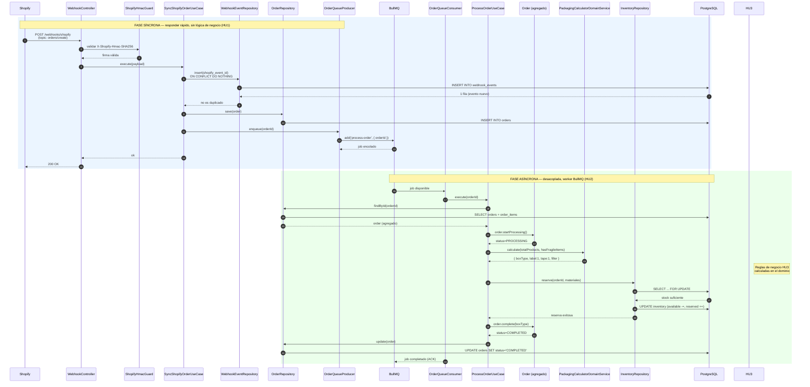
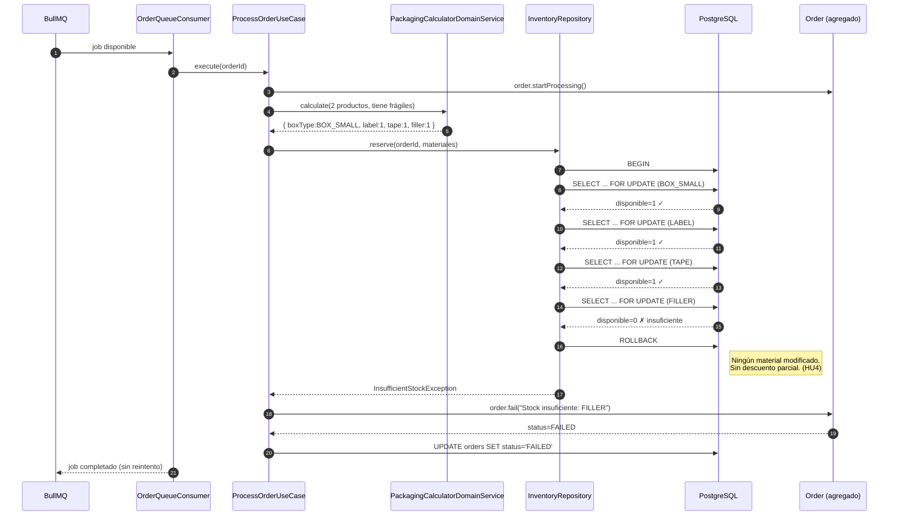
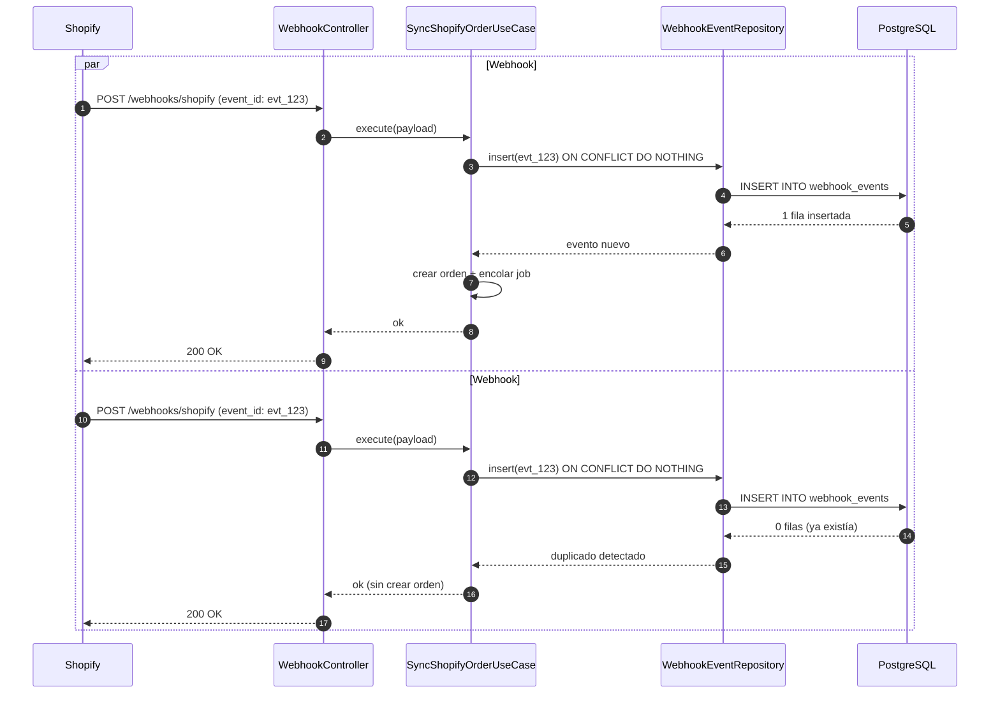
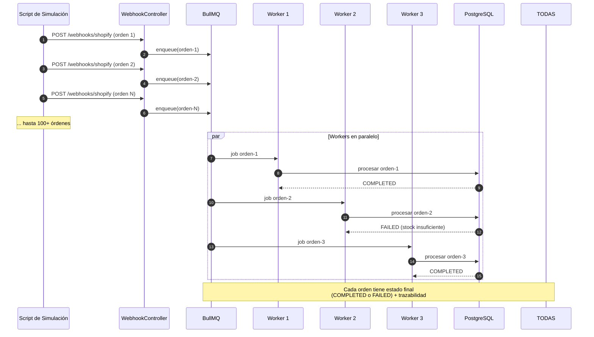

# Diagramas de Secuencia — Flujos del Sistema

Este documento contiene los diagramas de secuencia principales del sistema de gestión de órdenes Shopify e inventario de material de empaque, alineados con las 5 historias de usuario del reto técnico.

---

## 1. Flujo Principal Exitoso (HU1 + HU2 + HU3 + HU4)

Desde la recepción del webhook hasta que la orden queda `COMPLETED`, mostrando la separación entre la fase síncrona (HU1) y la fase asíncrona (HU2).



---

## 2. Flujo de Fallo por Stock Insuficiente (HU4)

Sin descuentos parciales: si **un solo** material no alcanza, no se modifica ningún stock.



---

## 3. Flujo de Webhook Duplicado (HU1 — Idempotencia)

Shopify reenvía el mismo evento (`orders/create`) dos veces casi simultáneamente.



---

## 4. Flujo de Procesamiento Masivo (HU2)

Procesamiento de 100+ órdenes simuladas de forma desacoplada.



---

## 5. Flujo del Panel Operativo (HU5)

Consulta del dashboard y compatibilidad legacy.

```mermaid
sequenceDiagram
    autonumber
    participant User as Usuario Operativo
    participant SPA as Vue 3 Dashboard
    participant API as API Backend
    participant PHP as Legacy PHP
    participant DB as PostgreSQL

    User->>SPA: Abrir panel operativo
    SPA->>API: GET /orders
    API->>DB: SELECT orders
    DB-->>API: lista de órdenes
    API-->>SPA: 200 OK (órdenes)
    SPA->>User: Mostrar listado de órdenes

    SPA->>API: GET /inventory
    API->>DB: SELECT inventory
    DB-->>API: niveles de stock
    API-->>SPA: 200 OK (inventario)
    SPA->>User: Mostrar inventario actual

    User->>SPA: Filtrar por estado FAILED
    SPA->>API: GET /orders?status=FAILED
    API->>DB: SELECT orders WHERE status='FAILED'
    API-->>SPA: órdenes fallidas
    SPA->>User: Mostrar órdenes fallidas

    User->>SPA: Ver detalle de orden
    SPA->>API: GET /orders/:id
    API->>DB: SELECT order + order_materials
    API-->>SPA: detalle con materiales
    SPA->>User: Mostrar materiales utilizados

    Note over PHP,DB: Compatibilidad Legacy (HU5)
    User->>PHP: GET /materiales-bajo-stock.php
    PHP->>DB: SELECT materials con stock < umbral
    DB--PHP: materiales bajo stock
    PHP-->>User: [{"material": "BOX_SMALL", "stock": 5}]
```

---

## Trazabilidad con Historias de Usuario

| Diagrama | HU Relacionada |
|---|---|
| 1. Flujo principal | HU1, HU2, HU3, HU4 |
| 2. Fallo por stock | HU4 |
| 3. Webhook duplicado | HU1 |
| 4. Procesamiento masivo | HU2 |
| 5. Panel operativo | HU5 |

---

**Documento generado por:** OWL — Senior Software Architect
**Versión:** 3.0
**Fecha:** 2025-07-15
