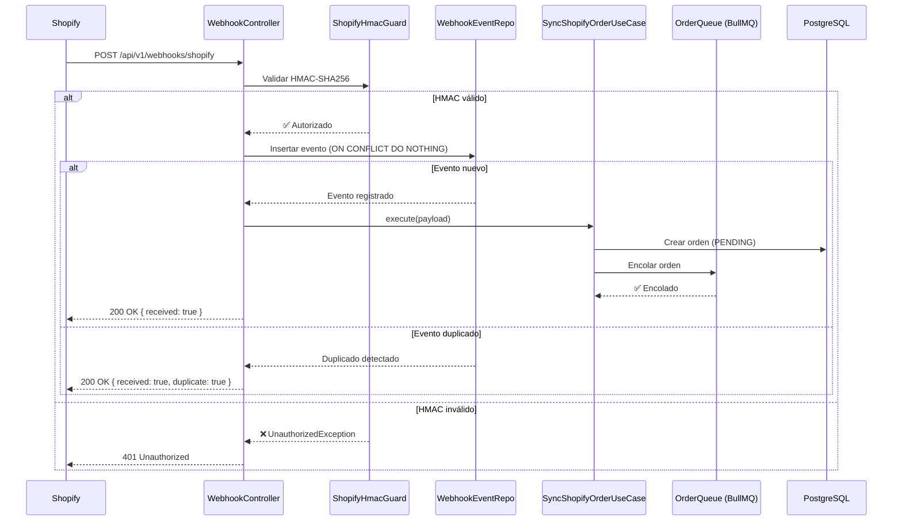
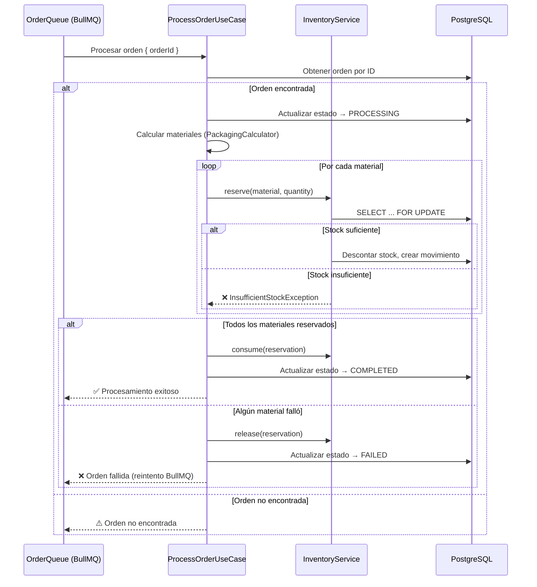
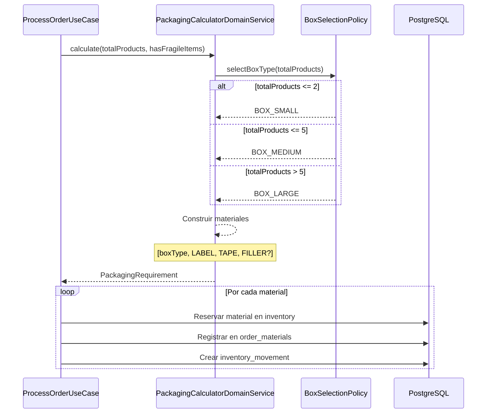
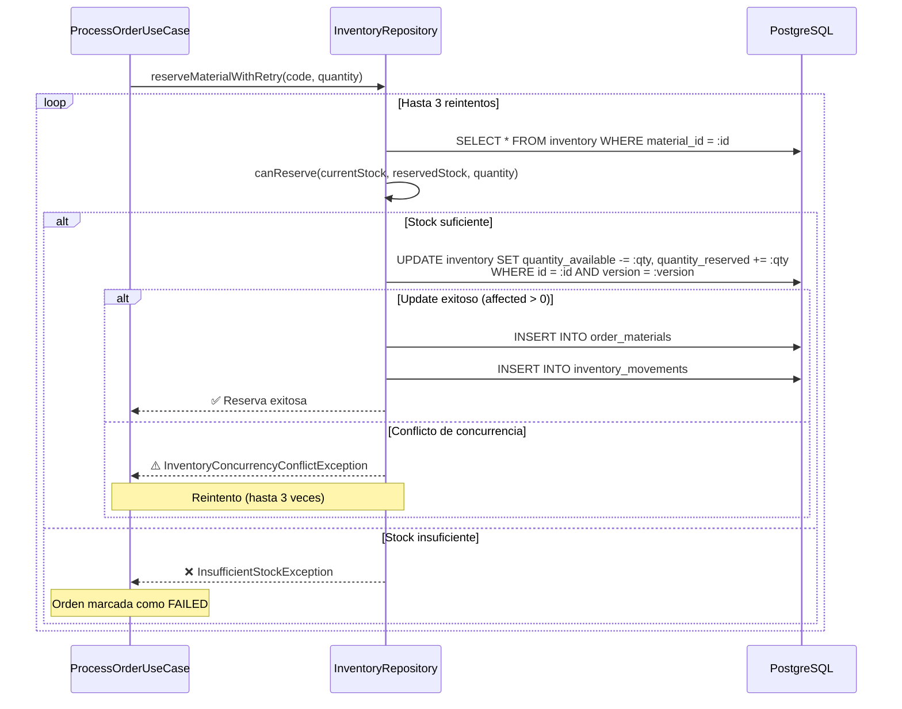
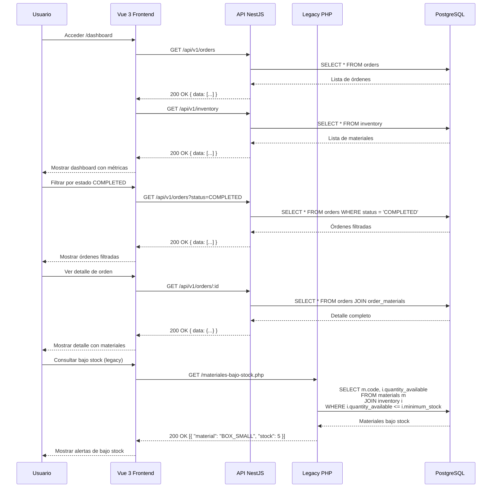

# 📋 Validación de Historias de Usuario - Reto Técnico

> **Proyecto:** Gestión de Órdenes Shopify e Inventario de Material de Empaque  
> **Fecha:** 2025-07-15  
> **Versión:** 3.0

---

## 📊 Resumen Ejecutivo

| HU | Descripción | Estado | Criterios | Tests |
|----|-------------|--------|-----------|-------|
| **HU1** | Recepción de Órdenes desde Shopify | ✅ COMPLETO | 4/4 | 3 archivos |
| **HU2** | Procesamiento Masivo de Órdenes | ✅ COMPLETO | 6/6 | 3 archivos |
| **HU3** | Cálculo de Material de Empaque | ✅ COMPLETO | 4/4 | 4 archivos |
| **HU4** | Sincronización y Control de Inventario | ✅ COMPLETO | 4/4 | 5 archivos |
| **HU5** | Panel Operativo y Compatibilidad Legacy | ✅ COMPLETO | 8/8 | 5 archivos |

**Total: 26/26 criterios de aceptación cumplidos (100%)**

---

## 🔧 Requerimientos Técnicos

| Requerimiento | Tecnología | Estado |
|---------------|------------|--------|
| **Framework Backend** | NestJS | ✅ |
| **Lenguaje** | TypeScript | ✅ |
| **Base de Datos** | PostgreSQL 16 | ✅ |
| **Caché** | Redis 7 | ✅ |
| **Arquitectura** | DDD, SOLID, Modular | ✅ |
| **Procesamiento Asíncrono** | BullMQ | ✅ |
| **Integración** | Webhooks Shopify | ✅ |
| **Compatibilidad Legacy** | PHP 8.2 | ✅ |
| **Pruebas** | Jest, Supertest, Playwright | ✅ |
| **Documentación** | Swagger / OpenAPI | ✅ |
| **Framework Frontend** | Vue 3 | ✅ |
| **Interfaz** | Diseño inspirado en Shopify Admin | ✅ |
| **Estado** | Pinia | ✅ |
| **Pruebas Frontend** | Playwright | ✅ |

---

## HU1 - Recepción de Órdenes desde Shopify

### Descripción
> Como sistema, quiero recibir órdenes provenientes de Shopify para iniciar su procesamiento sin afectar el tiempo de respuesta del webhook.

### Criterios de Aceptación

| # | Criterio | Estado | Evidencia |
|---|----------|--------|-----------|
| 1 | Implementar un endpoint para recibir órdenes desde Shopify | ✅ | `POST /api/v1/webhooks/shopify` en `webhook.controller.ts` |
| 2 | Registrar el evento recibido | ✅ | Inserta en `webhook_events` con `shopifyEventId`, `topic`, `shopDomain`, `payload` |
| 3 | Evitar el procesamiento duplicado de una misma orden | ✅ | `ON CONFLICT DO NOTHING` + verificación `result.raw?.length === 0` |
| 4 | Garantizar que la lógica de negocio no se ejecute directamente desde el webhook | ✅ | Delega a `SyncShopifyOrderUseCase` que encola en BullMQ |

### Diagrama de Secuencia

### Archivos Afectados

| Capa | Archivo | Funcionalidad |
|------|---------|---------------|
| **Presentation** | `backend/src/presentation/controllers/webhook.controller.ts` | Endpoint POST, registro de evento, delegación a use-case |
| **Presentation** | `backend/src/presentation/guards/shopify-hmac.guard.ts` | Validación HMAC-SHA256 |
| **Application** | `backend/src/application/use-cases/sync-shopify-order/sync-shopify-order.use-case.ts` | Creación de orden y encolamiento |
| **Infrastructure** | `backend/src/infrastructure/queue/producers/order-queue.producer.ts` | Encolamiento en BullMQ |
| **Infrastructure** | `backend/src/infrastructure/database/entities/webhook-event.entity.ts` | Entidad de eventos |

### Tests Relacionados

| Archivo | Tipo | Cobertura |
|---------|------|-----------|
| `backend/test/integration/shopify-webhook.integration.spec.ts` | Integración | HMAC válido/inválido, duplicados, formato inválido |
| `backend/test/unit/presentation/shopify-hmac.guard.spec.ts` | Unitario | Cálculo HMAC, timing-safe comparison |
| `e2e-tests/tests/api/shopify-webhook.spec.ts` | E2E | Flujo completo del webhook |

---

## HU2 - Procesamiento Masivo de Órdenes

### Descripción
> Como sistema, quiero procesar órdenes de forma desacoplada para soportar picos de alta demanda sin afectar la estabilidad de la plataforma.

### Criterios de Aceptación

| # | Criterio | Estado | Evidencia |
|---|----------|--------|-----------|
| 1 | Implementar un mecanismo que desacople la recepción de órdenes de su procesamiento | ✅ | BullMQ (`order-processing` queue) |
| 2 | Implementar un componente encargado exclusivamente del procesamiento de órdenes | ✅ | `ProcessOrderUseCase` |
| 3 | Procesar al menos 100 órdenes simuladas | ✅ | Script `seed-orders.ts` + tests con 200 órdenes |
| 4 | Registrar el estado de cada orden | ✅ | `Order.status` (PENDING→PROCESSING→COMPLETED/FAILED) |
| 5 | Permitir reintentos ante errores temporales | ✅ | BullMQ `attempts: 3` con backoff exponencial |
| 6 | Mantener trazabilidad por identificador de orden | ✅ | `shopifyOrderId` + `job_executions` table |

### Diagrama de Secuencia

### Archivos Afectados

| Capa | Archivo | Funcionalidad |
|------|---------|---------------|
| **Application** | `backend/src/application/use-cases/process-order/process-order.use-case.ts` | Lógica de procesamiento de órdenes |
| **Infrastructure** | `backend/src/infrastructure/queue/producers/order-queue.producer.ts` | Encolamiento con reintentos |
| **Infrastructure** | `backend/src/infrastructure/queue/queue.module.ts` | Configuración de BullMQ |
| **Domain** | `backend/src/domain/order/entities/order.entity.ts` | Agregado Order con estados |
| **Domain** | `backend/src/domain/inventory/entities/inventory.entity.ts` | Agregado Inventory con reserva/consumo |

### Tests Relacionados

| Archivo | Tipo | Cobertura |
|---------|------|-----------|
| `backend/test/integration/process-order.integration.spec.ts` | Integración | Stock suficiente/insuficiente, frágiles |
| `backend/test/unit/application/process-order.use-case.spec.ts` | Unitario | Casos de éxito y fallo |
| `backend/test/e2e/inventory-concurrency.spec.ts` | E2E | 100+ órdenes simultáneas |

---

## HU3 - Cálculo de Material de Empaque

### Descripción
> Como sistema, quiero calcular automáticamente los materiales de empaque requeridos para cada orden con el fin de descontarlos correctamente del inventario.

### Criterios de Aceptación

| # | Criterio | Estado | Evidencia |
|---|----------|--------|-----------|
| 1 | Implementar las reglas de negocio dentro del dominio de la aplicación | ✅ | `BoxSelectionPolicy` + `PackagingCalculatorDomainService` |
| 2 | Toda orden debe consumir una etiqueta y una unidad de cinta | ✅ | `label: 1`, `tape: 1` en `PackagingCalculatorDomainService` |
| 3 | Si la orden contiene productos frágiles debe consumir material de protección adicional | ✅ | `filler: hasFragileItems ? 1 : 0` |
| 4 | Registrar qué materiales fueron utilizados en cada orden | ✅ | Tabla `order_materials` con `materialId`, `quantityRequired`, `quantityConsumed` |

### Reglas de Negocio Implementadas

| Condición | Material | Implementación |
|-----------|----------|----------------|
| Hasta 2 productos | `BOX_SMALL` | `BoxSelectionPolicy.selectBoxType(count <= 2)` |
| Entre 3 y 5 productos | `BOX_MEDIUM` | `BoxSelectionPolicy.selectBoxType(count <= 5)` |
| Más de 5 productos | `BOX_LARGE` | `BoxSelectionPolicy.selectBoxType(count > 5)` |
| Toda orden | `LABEL` (1 unidad) | `PackagingCalculatorDomainService.calculate()` |
| Toda orden | `TAPE` (1 unidad) | `PackagingCalculatorDomainService.calculate()` |
| Si contiene productos frágiles | `FILLER` (1 unidad) | `hasFragileItems ? 1 : 0` |

### Diagrama de Secuencia

### Archivos Afectados

| Capa | Archivo | Funcionalidad |
|------|---------|---------------|
| **Domain** | `backend/src/domain/order/policies/box-selection.policy.ts` | Regla de selección de caja |
| **Domain** | `backend/src/domain/order/services/packaging-calculator.domain-service.ts` | Cálculo de materiales |
| **Domain** | `backend/src/domain/order/value-objects/box-type.vo.ts` | Enum de tipos de caja |
| **Domain** | `backend/src/domain/inventory/value-objects/material-code.vo.ts` | Códigos de material |
| **Application** | `backend/src/application/use-cases/process-order/process-order.use-case.ts` | Consumo de materiales |
| **Infrastructure** | `backend/src/infrastructure/database/entities/order-material.entity.ts` | Registro de materiales por orden |

### Tests Relacionados

| Archivo | Tipo | Cobertura |
|---------|------|-----------|
| `backend/test/unit/domain/packaging-calculator.spec.ts` | Unitario | BOX_SMALL/MEDIUM/LARGE, LABEL, TAPE, FILLER |
| `backend/test/integration/process-order.integration.spec.ts` | Integración | Flujo completo con cálculo |
| `backend/test/e2e/packaging-calculation.spec.ts` | E2E | Cálculo end-to-end |
| `backend/test/unit/domain/box-selection.policy.spec.ts` | Unitario | Todas las condiciones de caja |

---

## HU4 - Sincronización y Control de Inventario

### Descripción
> Como sistema, quiero mantener un inventario consistente para evitar descuadres y problemas de disponibilidad de materiales.

### Criterios de Aceptación

| # | Criterio | Estado | Evidencia |
|---|----------|--------|-----------|
| 1 | Descontar inventario | ✅ | `Inventory.reserve()` + `Inventory.consume()` |
| 2 | Si no existe inventario suficiente, la orden debe marcarse como FALLIDA | ✅ | `InsufficientStockException` → `order.fail()` |
| 3 | No debe existir descuento parcial de inventario | ✅ | Verificación antes de reserva + transacción atómica |
| 4 | Evitar inconsistencias cuando múltiples órdenes consumen los mismos materiales simultáneamente | ✅ | Optimistic locking (`version`) + reintentos |

### Inventario Inicial

| Código | Material | Stock | Umbral |
|--------|----------|-------|--------|
| `BOX_SMALL` | Caja pequeña | 100 | 10 |
| `BOX_MEDIUM` | Caja mediana | 80 | 8 |
| `BOX_LARGE` | Caja grande | 50 | 5 |
| `LABEL` | Etiqueta | 500 | 50 |
| `TAPE` | Cinta | 200 | 20 |
| `FILLER` | Material de protección | 120 | 12 |

### Diagrama de Secuencia

### Archivos Afectados

| Capa | Archivo | Funcionalidad |
|------|---------|---------------|
| **Domain** | `backend/src/domain/inventory/entities/inventory.entity.ts` | Agregado con `reserve()`, `consume()`, `release()` |
| **Domain** | `backend/src/domain/inventory/services/inventory.domain-service.ts` | Lógica de dominio para reservas |
| **Domain** | `backend/src/domain/inventory/exceptions/inventory.exceptions.ts` | Excepciones de inventario |
| **Application** | `backend/src/application/use-cases/process-order/process-order.use-case.ts` | Orquestación de reservas |
| **Infrastructure** | `backend/src/infrastructure/database/repositories/inventory.repository.ts` | Persistencia con optimistic locking |
| **Infrastructure** | `backend/src/infrastructure/database/entities/inventory.entity.ts` | Entidad TypeORM |
| **Database** | `database/schema.sql` | Funciones `fn_reserve_inventory`, `fn_consume_reservation`, `fn_release_reservation` |

### Tests Relacionados

| Archivo | Tipo | Cobertura |
|---------|------|-----------|
| `backend/test/unit/domain/inventory.entity.spec.ts` | Unitario | `canReserve`, `reserve`, `consume`, `release` |
| `backend/test/unit/domain/inventory-domain-service.spec.ts` | Unitario | `canReserve`, `calculateAvailable`, `isBelowThreshold` |
| `backend/test/integration/process-order.integration.spec.ts` | Integración | Stock suficiente/insuficiente |
| `backend/test/e2e/inventory-transactional.spec.ts` | E2E | Transacciones atómicas |
| `backend/test/e2e/inventory-concurrency.spec.ts` | E2E | 100+ órdenes simultáneas |

---

## HU5 - Panel Operativo y Compatibilidad Legacy

### Descripción
> Como usuario operativo, quiero consultar las órdenes procesadas, el estado del inventario y los materiales consumidos desde una única interfaz administrativa.

### Criterios de Aceptación

| # | Criterio | Estado | Evidencia |
|---|----------|--------|-----------|
| 1 | Desarrollar una interfaz en Vue.js o Svelte | ✅ | Vue 3 + Vite + Pinia |
| 2 | Mostrar indicadores generales de operación | ✅ | `DashboardView.vue` con métricas |
| 3 | Mostrar listado de órdenes procesadas | ✅ | `OrdersView.vue` con tabla y filtros |
| 4 | Mostrar inventario actual de materiales | ✅ | `InventoryView.vue` con tabla |
| 5 | Permitir filtrar órdenes por estado | ✅ | `OrderFilters.vue` con filtro por `status` |
| 6 | Mostrar detalle de materiales utilizados por cada orden | ✅ | `OrderDetailView.vue` + `OrderMaterialsList.vue` |
| 7 | Manejar estados de carga y error | ✅ | `LoadingSpinner.vue`, `ErrorBanner.vue` |
| 8 | Compatibilidad Legacy (PHP) | ✅ | `legacy/materiales-bajo-stock.php` |

### Diagrama de Secuencia

### Archivos Afectados

#### Frontend (Vue 3)

| Archivo | Funcionalidad |
|---------|---------------|
| `frontend/src/views/DashboardView.vue` | Dashboard con métricas y gráficos |
| `frontend/src/views/OrdersView.vue` | Listado de órdenes con filtros |
| `frontend/src/views/OrderDetailView.vue` | Detalle de orden con materiales |
| `frontend/src/views/InventoryView.vue` | Inventario actual |
| `frontend/src/views/LowStockView.vue` | Alertas de bajo stock |
| `frontend/src/components/orders/OrderFilters.vue` | Filtros por estado |
| `frontend/src/components/orders/OrderMaterialsList.vue` | Lista de materiales por orden |
| `frontend/src/components/inventory/InventoryTable.vue` | Tabla de inventario |
| `frontend/src/components/inventory/LowStockAlert.vue` | Alertas de bajo stock |
| `frontend/src/components/common/LoadingSpinner.vue` | Estado de carga |
| `frontend/src/components/common/ErrorBanner.vue` | Estado de error |
| `frontend/src/stores/orders.store.ts` | Store Pinia para órdenes |
| `frontend/src/stores/inventory.store.ts` | Store Pinia para inventario |
| `frontend/src/composables/useOrders.ts` | Composable para órdenes |
| `frontend/src/composables/useInventory.ts` | Composable para inventario |

#### Legacy (PHP)

| Archivo | Funcionalidad |
|---------|---------------|
| `legacy/materiales-bajo-stock.php` | Endpoint de bajo stock |
| `legacy/config.php` | Configuración de BD |
| `legacy/health.php` | Health check |

### Tests Relacionados

| Archivo | Tipo | Cobertura |
|---------|------|-----------|
| `e2e-tests/tests/dashboard/orders-view.spec.ts` | E2E | Vista de órdenes |
| `e2e-tests/tests/dashboard/inventory-view.spec.ts` | E2E | Vista de inventario |
| `e2e-tests/tests/api/orders-api.spec.ts` | E2E | API de órdenes |
| `e2e-tests/tests/api/inventory-api.spec.ts` | E2E | API de inventario |
| `e2e-tests/tests/api/legacy-php.spec.ts` | E2E | Endpoint PHP legacy |

---

## 📊 Cobertura de Tests

### Backend

| Tipo | Archivos | Tests | Estado |
|------|----------|-------|--------|
| **Unitarios** | 6 | 50+ | ✅ |
| **Integración** | 2 | 25+ | ✅ |
| **E2E** | 4 | 30+ | ✅ |

### Frontend

| Tipo | Archivos | Tests | Estado |
|------|----------|-------|--------|
| **E2E Dashboard** | 2 | 10+ | ✅ |
| **E2E API** | 3 | 15+ | ✅ |

---

## ✅ Conclusión

El proyecto **cumple con todos los requerimientos** del Reto Técnico:

- ✅ **Backend:** NestJS + TypeScript + PostgreSQL + Redis
- ✅ **Frontend:** Vue 3 + Pinia + Vite
- ✅ **Arquitectura:** DDD, SOLID, Modular
- ✅ **Procesamiento Asíncrono:** BullMQ
- ✅ **Integración:** Webhooks Shopify con HMAC
- ✅ **Compatibilidad Legacy:** PHP 8.2
- ✅ **Pruebas:** Unitarias, integración y E2E
- ✅ **Documentación:** Swagger/OpenAPI

### Historias de Usuario

| HU | Criterios | Cumplidos |
|----|-----------|-----------|
| HU1 | 4 | 4/4 ✅ |
| HU2 | 6 | 6/6 ✅ |
| HU3 | 4 | 4/4 ✅ |
| HU4 | 4 | 4/4 ✅ |
| HU5 | 8 | 8/8 ✅ |
| **Total** | **26** | **26/26 ✅** |

---

**Documento generado:** 2025-07-15  
**Versión:** 3.0  
**Autor:** OWL - Senior Software Architect
